# Javascript_마무리

## hw review

- JavaScript는 single threaded 언어로 한번에 한가지 일 밖에 처리하지 못한다.  

  true

- setTimeout은 브라우저의 Web API를 사용하는 함수로, Web API에서 동작이 완료 되면 Call Stack에 바로 할당된다. 

  false / task queue를 들렸다가 할당된다.

- Promise 객체를 생성할 때 인자로 받는 callback 함수인 resolve와 reject는 비동기 처리가 ''성공/실패 했을 경우 어떠한 값을 전달할지 결정한다. ''

  true

  인자로 받는 callback함수? .then(), .catch() 내부에 들어가는 것이 callback함수.

- Promise 객체의 .then 메서드는 오류 없이 resolve 되었을 때 실행되는 함수이며, .catch 메서드는 도중에 오류가 발생하여 reject 되었을 때 실행되는 함수이다

  true

- JavaScript에서 동기와 비동기 함수의 차이점을 서술하시오.

  면접질문이면 여러가지를 물어봤을수도있는 질문.

  동기(blocking), 비동기(non-blocking)으로 얘기할 수 있을건데, 대부분의 함수는 동기적으로 작동을합니다. 근데 Web API가 담담하는 몇몇가지 애들은 처리를 안한다기보다는 내가 안하는 것이 아니라 Web API가 진행을 하게되고 JS interpreter는 해당내용을 jump하는 것처럼 보인다.

  call stack(함수 호출을 담아 놓는다.)

  - Event Loop : http://latentflip.com/loupe/

  

- 순서가 중요하다면?

  ```js
  setTimeout(function () {
      setTimeout(function () {
          setTimeout(function () {
              // ...
          }, 99)
      }, 101)
  }, 100)
  ```

  콜백함수에 다음 와야하는 함수를 넣어줌으로서 확실한 순서를 만들어주어야만 하는데 이게 심해지면 피라미드 지옥이 만들어지는 것.

  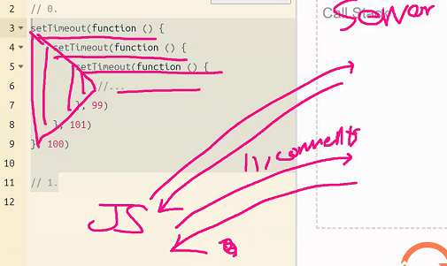

- 

a : get

b : then

c : response**.data**

​	data를 넣어줘야만 파씽된 data(object)를 주게됩니다.

---

## 실습(오전)

- accounts.views.follow

  ```python
  @require_POST
  def follow(request, user_pk):
      if request.user.is_authenticated:
          # 팔로우 받는 사람
          you = get_object_or_404(get_user_model(), pk=user_pk)
          me = request.user
  
          # 나 자신은 팔로우 할 수 없다.
          if you != me:
              if you.followers.filter(pk=me.pk).exists():
              # if request.user in person.followers.all():
                  # 팔로우 끊음
                  you.followers.remove(me)
              else:
                  # 팔로우 신청
                  you.followers.add(me)
          return redirect('accounts:profile', you.username)
      return redirect('accounts:login')
  ```

- articles.views.likes

  ```python
  @require_POST
  def likes(request, article_pk):
      if request.user.is_authenticated:
          article = get_object_or_404(Article, pk=article_pk)
  
          if article.like_users.filter(pk=request.user.pk).exists():
          # if request.user in article.like_users.all():
              # 좋아요 취소
              article.like_users.remove(request.user)
          else:
              # 좋아요 누름
              article.like_users.add(request.user)
          return redirect('articles:index')
      return redirect('accounts:login')
  ```

- 어떻게해야 좋아요, follow가 화면전환없이 이루어질 수 있을 것인가??

  axios라는 것을 쓸건데 어디에서 쓰는지? templates

  

  - CDN가져오는데 제공업체가 다른거라서 뭘 쓰던지 상관은없습니다.

- articles/index.html

  기존의 form태그의 action, method는 필요없어지게된다.(이 둘은 새로고침이 일어나기 때문)

  

  id를 주려고하지만 for문에서 모든 경우 id가 동일해지기 때문에 이 경우에는 class를 사용하게 됨.

- querySelectorAll의 return값은 NodeList고, 이건 유사배열, 유사배열은 .forEach만 지원한다!

- 선택 -> event evnet는 submit -> 최종적으로는 서버에 좋아요했다는 요청이 갈것(이러한 컨셉을 먼저 잡고 시작하자)

 // 태그마다 본인이 가지고있는 요소가 존재한다(a태그의경우 src와같이)

 // 필요에 따라서 커스터마이즈가 가능하다. data-*방식으로.

 // 그 이유는 자바스크립트에서 사용하기위해서

```html
<h1 data-luch="단식">Articles</h1>
<script>
    h1.dataset.lunch
</script>
```


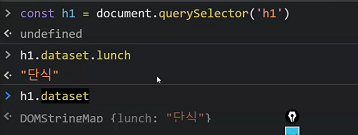

- django script csrf_token

  

  name이 csrfmiddlewaretoken인 애를 select하겠다는 것

---

## 실습(오후)

- 시나리오를 먼저 작성하는 것이 중요합니다.(modeling하는 것이 중요)

  

- 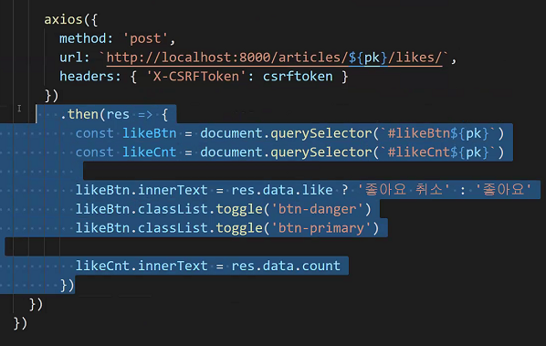

- 함수따라 정의하고 함수 따라 정의하면 되는것이 수동으 

- res.data.templ;ate를 따라서 종융기 뭐하는 것인지

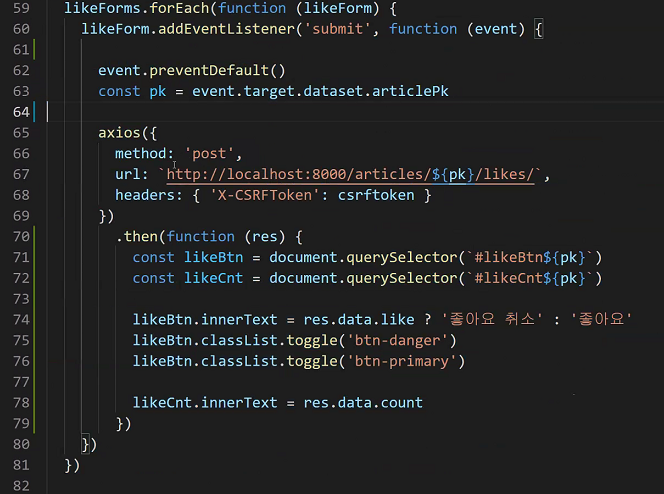

---

```js
// Rest Operator
function withoutRestOpr(a, b, c, d, e) {
    const numbers = [a, b, c, d, e]
    numbers.map(num => num + 1)
}

// def a(*args)
function withRestOpr(...numbers) {
    numbers.map(num => num + 1)
}

// Spread Operator
function withoutSpreadOpr() {
    const odds = [1, 3, 5, 7]
    const evens = [2, 4, 6, 8]
    const nums = odds.concat(evens)
}

function withSpreadOpr() {
    const odds = [1, 3, 5, 7]
    const evens = [2, 4, 6, 8]
    // python: [*odds, *evens]
    const nums = [...odds, ...evens]
}
```

- Class.js

```js
// Class
Class Car:
	def __init__(self, options):
    	self.title = options.get('title')
    
	def drvie(self):
    	return '부릉부릉'

car = car('title': 'bmw', 'color': 'blue')
car = Car(options)
car.title  // => BMW
car.drvie() '부릉 부릉'
```

- views.py

```js
function Car(options) {
    this.title = options.title
} def __Init__(self, options):

drom drvie(self):
	 return 즉시 선발
```

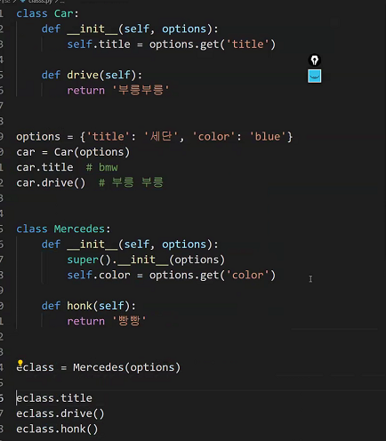

```js
// 사람들이 코드쓸때 편하려고 하는
// syntatic sugar
class Car {
    // __init__()
    constructor(options) {
        this.title = options.title
    }
    // method
    drive() {
        return `${this.title}은 부릉부릉 달린다!`
    }
}

class Mercedes extends Car {
    constructor(options) {
        super(options)
        this.color = options.color
    }
    
    honk() {
        return '빵빵'
    }
}

const options = {title: '세단', color: 'blue'}
const eclass = new Merceded(options)


const str = new Car(options)

car.title
car.drive()
```

---

- this.js

```js
// this

/*
	this는 아래의 경우를 제외하고 모두 최상위 객체(루트, 윈도우)를 가르킨다.(bind된다)
	1. constructor 함수 내부에서 => 생성될 객체를 가르킨다.
	2. '메서드' === (obj.method로 호출됨)에서 => 메서드가 소속된 객체(object)를 가르킨다.
		1. Object에서 Key - function으로 정의된 것
		2. class 정의 내부의 메서드 정의
*/

const edgar = {
    name: '김명준',
    greeting: function () {
        return `안녕하세요 ${this.name}입니다.`
    }
}
```

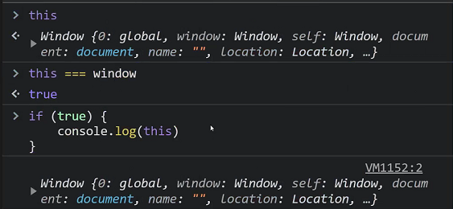

- 메서드와 함수의 차이는 결국 소속의 차이. 

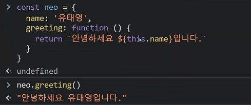

- 

- 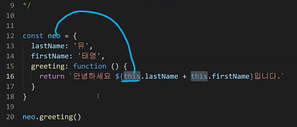
  
- 이 경우, this와 neo가 bind된 것
  
- 

  harry.greeting()  // method true => .greeting() o

  greeting()  // method false => .greeting() x

```js
/**/
// without Arrow function
const double = {
    numbers: [1, 2, 3, 4],
    x: 2,
    get_double() {
        const doubled = this.numbers.map(function (num){
            return num * this.x
        })
        return doubled
    }
}

double.get_double() => Nan
```


- this.numbers에서의 this는 ok

- 

  해당하는 부분은 메서드가 아니기떄문에 해당되지 않는 것.

  따라서 위의 this와 함수 내부의 this(window)를 엮어주어야만 합니다.

  

  정리하자면, .map의 cb함수는 메서드가 아니다. 고로 cb안의 this는 window가 된다.

```js
const triple = {
    numbers: [1, 2, 3, 4],
    x: 3,
    get_triple() {
        return this.numbers.map(num => num*this.x)
        /*
            (num) => {
                console.log(this)
                return num * this.x
            }
        return tripled
    }*/
}
```

이 때 .map의 인자 cb 함수는 메서드가 아니지만, Arrow function 으로 표현했기 때문에 this가 원하는대로 bind되었다.


---

- callback.js

```js
function make101() {
    const get100 = function(x) {return 100 + x}
    // const get100 = () => 100
    // return get100
    
    /*
    const myFunc = function (x) {
    	return 100 + x
    }
    return myFunce
    */
}
// 1. make101()하면 myFunc가 리턴되니까
// 2. myFunc(1)하면 101이 나온다.
function make101() {
    const myFunc = function (x) {
        return 100 + x
    }
    return myFunc
}
```

- cb함수에서 res는 어디서 오는가?

```js
/* map */
// arr.map( () => {} )

// map(arr, () => {} )

// 일반적으로는 함수 정의 이후 실행하는데
// 정의되지 않은 함수를 실행하고있다.
function map(cb ,arr) {
    const newArr = []
    for (const elem of arr) {
        newArr.push(cb(elem))
    }
    
    return newArr
}


function plusOne(num) {
    return num + 1
}
map(, [1, 2, 3, 4])

map(plusOne, [1,2,3,4])

map(num => num+1, [1,2,3,4])

map(function (num) {
    return num + 1
}, [1,2,3,4,5])
```

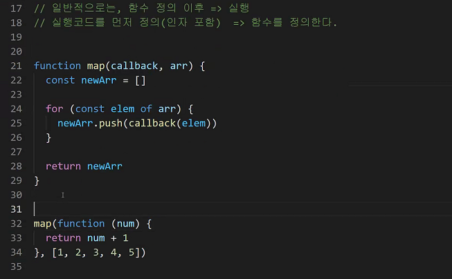

path 함수를 잠시보면

```python
def path(pattern, callback, name=None):
    if req.url == pattern:
        callback(req...)
        
def index(request):
    if request.method == 'POST'
```

이분이 이해가 되셨다면..

filter를 한번 만들어보시길

```python
function filter(callback, arr) {
    # 채우세요
}


# 아래는 바꿀 수 없습니다.
filter(function(num) {
    return num % 2
}, [1, 2, 3, 4, 5])

[1, 2, 3, 4, 5].filter(num => n % 2)
```

---

## Review

```js
function myFunc1() {}

var myFunc2 = function () {}

const myFunc3 = function () {}

const myFunc4 = () => {}
```

 ```js
// 실습 리뷰
// 기존의 filter 메서드
[1, 2, 3, 4, 5].filter(function (num) {
    return num % 2
})

// 구현해주신 filter함수
function filter(callback, arr) {
    const newArr = []
    for (const elem of arr) {
        if (callback(elem)) {  // callback true/false를 리턴하는 함수여야 한다.
            newArr.push(elem)
        }
    }
    return newArr
}

// 아래는 바꿀 수 없습니다.
filter(num => num % 2, [1, 2, 3, 4, 5]) // 리턴값이 0 or 1

[1, 2, 3, 4, 5].filter(num => num % 2)
 ```

위의 filter와 map을 비교해보면, map의 경우 callback함수의 리턴값을 푸쉬하고 filter의 경우에는 조건식으로 활용하게됩니다.

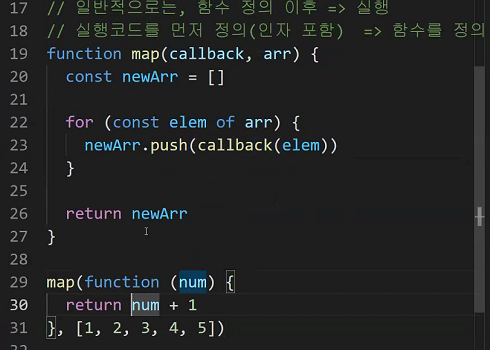

---

## hw_4 review

- Event Loop는 Call Stack이 비워지면 Task Queue의 함수들을 Call Stack으로 할당하 는 역할을 한다. True

- XMLHttpRequest(XHR)은 AJAX 요청을 생성하는 JavaScript API이다. XHR의 메서드로 브라우저와 서버간의 네트워크 요청을 전송할 수 있다. True

  모든 브라우저의 비동기요청(AJAX)는 XHR 기반으로 하고있고, XHR은 메서드로 브라우저와 서버간의 네트워크 요청을 전송할 수 있다. XHR을 패키징한 것이 바로 Axios

- axios는 XHR(XMLHttpRequest)을 보내고 응답 결과를 Promise 객체로 반환해주는 라이브러리이다. True

- JS는 Event loop를 기반으로 하는 Concurrency model을 가지고 있다고 한다.  Concurrency 키워드의 특징을 작성하고, 이와 비슷한 키워드로 비교되는 Parallelism의 개념과 두 개념의 차이점을 서술 하시오

  우리 컴퓨터가 한번에 많은 일(프로그램 업데이트, 압축, 방화벽, ...)을 처리합니다. 

  

  6코어 12스레드, 6개 방에 일꾼이 2명씩 들어가있다 => 그러면 12개 이상의 일은 못하는 건가? => 12개 이상의 일을 하면 뻗겠네..? 켤 수 있는 할 수 있는 작업이 정해져 있겠다고 생각할 수 있겠지만 그렇지 않습니다.

  컴퓨터 사용시 물리적인 사용량을 생각하면서 사용하지는 않습니다. 그 이유가 바로 'Concurrency'입니다. CPU는 기본적으로 연산속도가 무척 빠릅니다.

  

  트랜지스터(스위치 == 0과 1)가 초당 10억 사이클정도로 열고 닫을정도로 매우 빠릅니다. 

  각 일마다 감사하는 사람이 하나씩 배정되어있다고 생각해봅시다. 적당한 시간내에 적당히 다 같이 작업을 끝마칠 수 있도록 하는것이 가장 이상적일 겁니다. => 5개 일이 있다면 하나씩 하나씩 일을 조금씩 번갈아 가면서 하는 것. => 그렇게 하면 거의 비슷한 시간대에 모든 작업을 하는 것 처럼 보입니다.

  Concurrency Parallellism

  

  이 처럼 전반적으로 모든 일을 작업대(?)에서 하는 것처럼 보이는데 이 상태에서는 메모리(RAM)공간이 많이 필요하게 됩니다.

  연산은 PU(Process Unit)이 해야되는데 이건 CPU애들이 해야합니다.

  

  Parallel은 동시에 2개를 하는 것.

  Con 하난데 여러개를 처리하는 것처럼 보이는 거고 Para 는 각각이 일을 처리하는 것

  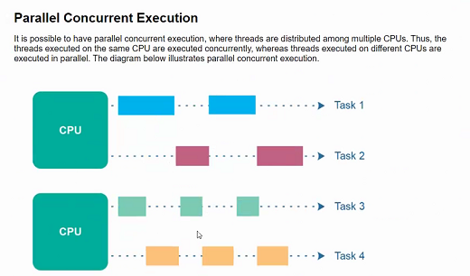

하나가 동시에 일

Parallism하나의 일을 여러명이 나눠서 하는 것