# HTTP 웹 기본 지식

- 모든 것이 HTTP 기반 위에서 동작

- 어디서, 왜 해당하는 기능이 필요한지에 대한 공부가 필요합니다.

- 개발자는 평생 HTTP 기반 위에서 개발을 해야합니다. 언젠가 한번은 정리해야하는걸 여기서 해보자

## 강의목표

- HTTP 전체 흐름
- 실무에 꼭 필요한 핵심내용
- 수 많은 예시와 그림으로 쉽게 설명

## 순서

- 인터넷 네트워크

- URI, 웹 브라우저
  - URL, URI, URN
  - HTTP 메시지 전송

- HTTP 기본
  - 무상태 - Stateless
  - 지속연결
- HTTP 메서드
  - GET POST PUT DELETE

- HTTP 메서드 활용

- HTTP 상태코드
- HTTP 헤더

- HTTP 캐시

## 1. 인터넷 네트워크

### 1.1. 인터넷 통신

인터넷에서 컴퓨터가 어떻게 통신할까?

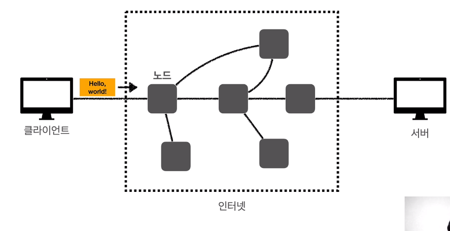

어떻게 목적지 까지 안전하게 데이터가 도착할까?

### 1.2. IP

- IP주소부여
- 지정한 IP주소에 데이터 전달
- 패킷(Packet)이라는 통신 단위로 데이터 전달
- IP패킷
  - 출발지IP, 목적지IP
  - 인터넷 망에 IP패킷을 던지게 되면 서로 노드끼리 던지기를 하다가 결국 최종 목적지IP에 데이터가 도달하게 된다

- IP프로토콜의 한계
  - 비연결성
    - 패킷을 받을 대상이 없거나 서비스 불능 사태여도 패킷이 전송됨(예를들어 친구서버가 꺼져있어도 패킷을 보냄)
    - 대상 서버가 패킷을 받을 수 있는 상태인지 모름
  - 비신뢰성
    - 신뢰할 수 없다.
    - 중간에 패킷이 사라진다면?(패킷소실)
    - 패킷이 순서대로 오지 않는다면?(패킷 전달 순서 문제) 보통 1500byte를 넘으면 나누어서 보내게 됨.
  - 프로그램 구분
    - 같은 IP를 사용하는 서버에서 통신하는 애플리케이션이 둘 이상이면?

### 1.3. TCP와 UDP

- TCP
  - 위에서의 여러가지 문제들(패킷소실, 전달 순서 등의 문제)을 해결하기 위한 프로토콜
  - 전송제어프로토콜
  - 특징
    - 연결지향 - TCP 3 way handshake(가상 연결)
    - 데이터 전달 보증
    - 순서 보장

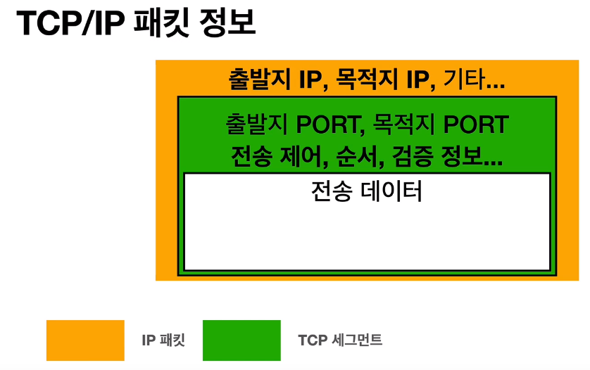

- 연결지향
  - 연결이 되지 않으면 데이터 전송과정이 이루어지지않는다.
  - 요즘에는 3ACK과정에서 데이터를 보내긴합니다.
  - 사실상 논리적인 연결이지 물리적인 연결은 아닙니다.

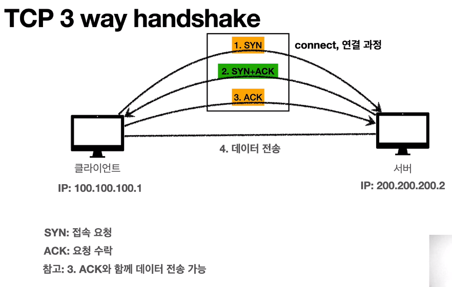

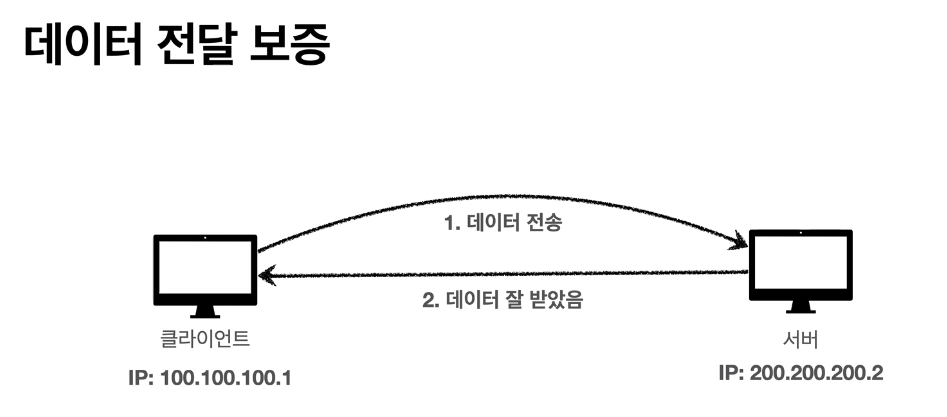

전송제어, 순서, 검증정보들이 TCP헤더에 담겨져 있어서 가능한 것

- UDP
  - 특징이 없음
  - IP와 거의 흡사하나 포트번호가 추가 됩니다.(패킷 구분을 위해서 사용되는 포트번호) + 데이터 검증을 위한 체크섬
  - 최근 각광? 웹브라우저에서 HTTP3.0 통신을 할 때, 3way shake 단계를 줄여보자라는 느낌이기 때문

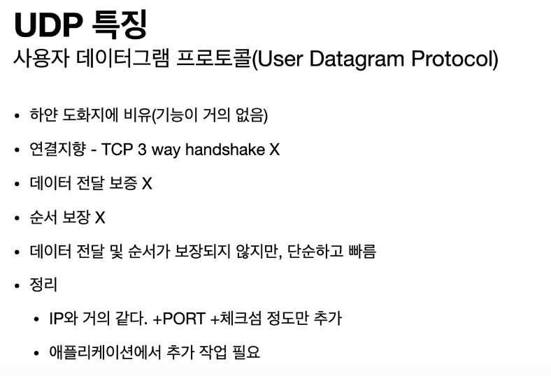

### 1.4. PORT

여러가지 패킷이 오면 어떤 애플리케이션에 대한 패킷인지 구분하는 것에 문제가 생긴다.

따라서 생긴 것이 포트번호(cf IP는 목적지 서버를 찾기위한 주소)

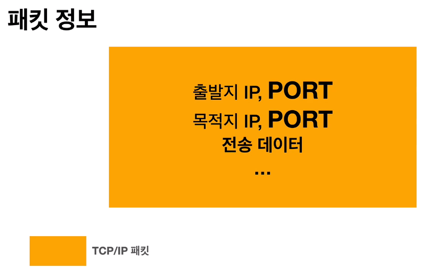

### 1.5. DNS

- IP는 기억하기 어렵다.
- IP는 변경될 수 있다.

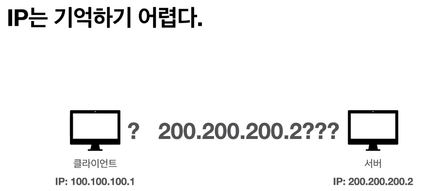

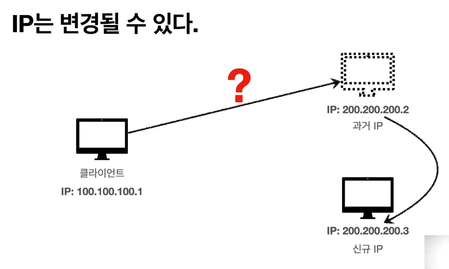

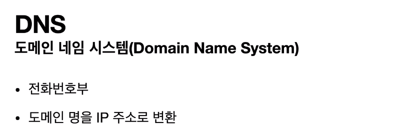

## 2. URI와 웹 브라우저 요청 흐름

### 2.1. URI(Uniform Resouce Indentifier)

- URI는 로케이터(locator), 이름(name) 또는 둘다 추가로 분류될 수 있다.

- Resource를 식별한다는 URI는 큰 개념(자원 자체를 식별하는 방법)

- URL(Resource Locator) : Resource의 위치
- URN(Resource Name) : Resource의 이름

- URN은 말 그대로 자원의 이름이라서 거의 URL을 사용하게 됩니다.

- Resource : URI로 식별할 수 있는 **모든 것**
- Identifier : 식별자

- URL : 리소스가 있는 위치를 지정

- URN : 리소스에 이름을 부여

  - 위치는 변할 수 있지만, 이름은 변하지 않는다.

  - isbn이 대표적인 예
  - URN 이름만으로 실제 리소스를 찾을 수 있는 방법이 보편화 되지 않음

- **앞으로 URI를 URL과 같은 의미로 이야기하겠음**

- URL 분석

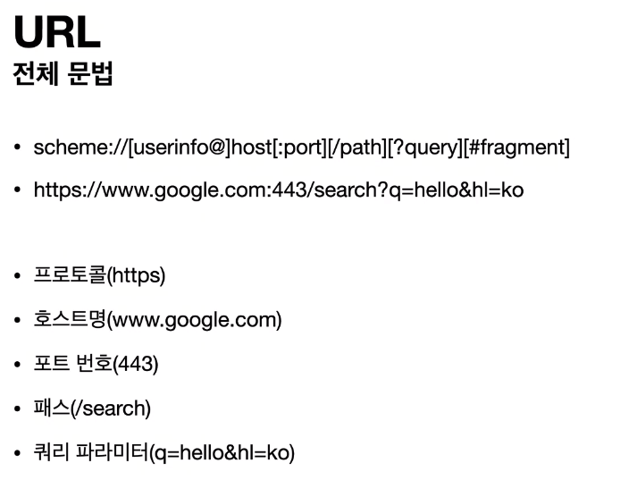

- 스키마(scheme) : 프로토콜 정보
  - 프로토콜 : 어떤 방식으로 자원에 접근할 것인가 하는 약속 규칙
  - http는 80포트, https는 443 포트를 주로 사용(포트는 생략 가능)
  - https는 http에 보안추가 (HTTP Secure)

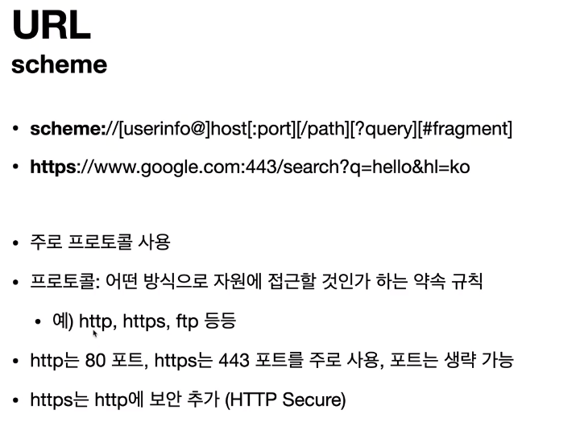

- userinfo : URL에 사용자정보를 포함하는 경우 사용
  - 거의 사용하지 않음

- 호스트명

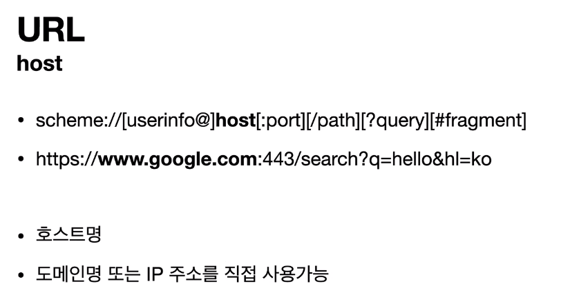

- 포트

- 패스 : 리소스의 경로
  - 보통 계층적구조로 되어있다.
  - 예시
    - /home/file1.jpg
    - /members
    - /members/100, /items/iphone12

- query
  - key=value의 형태
  - ?로 시작 &로 추가 가능
    - ?`keyA=valueA`&`keyB=valueB`
  - query parameter, query string 등으로 불림.

- frangment
  - html 내부 북마크 등에 사용
  - 서버에 전송되는 정보는 아님

### 2.2. 웹 브라우저 요청 흐름

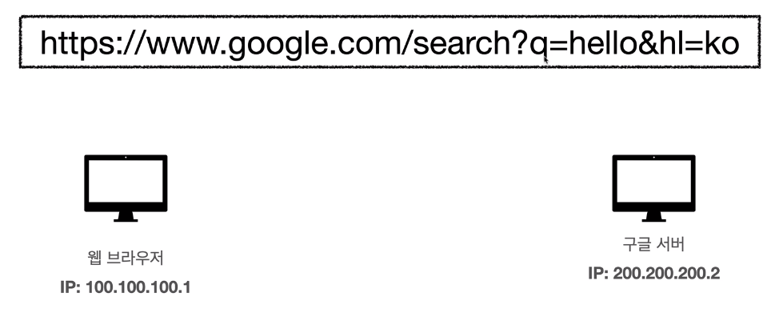

- 먼저 google.com의 IP주소를 찾기 위해서 DNS서버를 조회하게 됩니다.
- 포트정보는 https가 적혀져 있으므로 생략가능합니다
- 그러면 이제 HTTP 요청 메시지가 생성됩니다.

- HTTP 요청 메시지 생성
  - [메서드] /[패스]?[쿼리정보] [HTTP버전정보] [호스트]

- 이 패킷을 인터넷 망으로 던지고 수많은 노드를 통해서 목적지에 도착하게 됩니다.

- 서버에서 응답 메시지를 생성
  - Content-Type : 데이터의 형식(html) 언어는 UTF-8로 캐릭셋이 되어있다
  - Content-Length : 실제 데이터의 길이

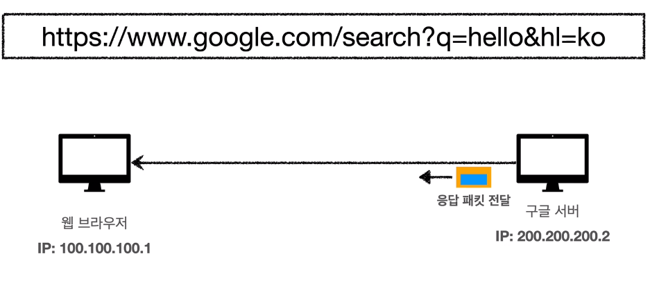

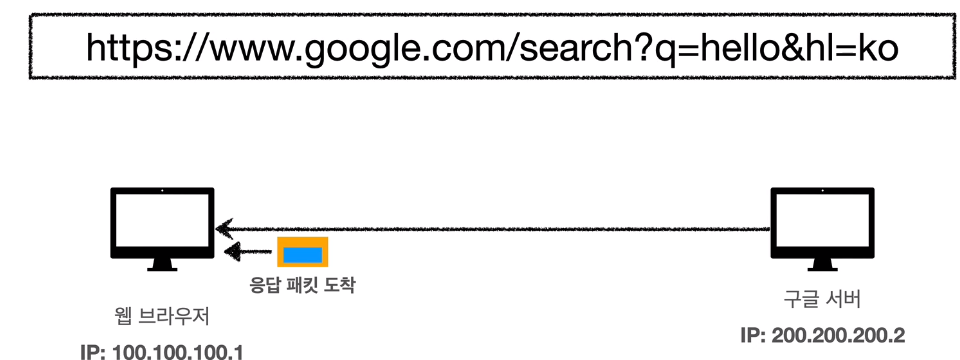

- html 데이터를 까서 우리에게 보여주게 됩니다.

