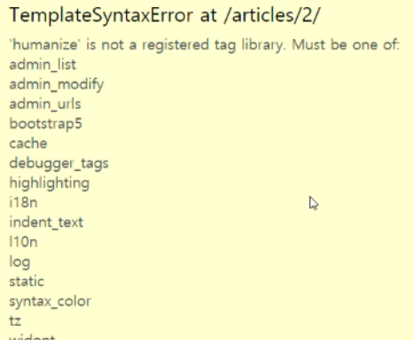

# django with 혁이형님

- 가상환경

  - venv
  - pip install
  - django-admin startproject instragram .
  - python manage.py startapp accounts
  - python manage.py startapp aarticles
    - 궁금한점 startapp accounts articles가능?

  - settings.py 설정
    - accounts, articles, django_extensions, bootstrap5, imagekit
    - AUTH_USER_MODEL
  - mkdir templates
    - touch templates/base.html
  - mkdir -p articles/templates/articles
  - mkdir -p accounts/templates/accounts
  - urls.py
    - path('accounts/', include('accounts.urls')),
    - path('articles/', include('articles.urls')),

- accounts/models.py

  ```python
  from django.db import models
  from django.contrib.auth.models import AbstractUser
  
  class User(AbstracUser):
      pass
  ```

- accounts/urls.py

  ```python
  from django.urls import path
  from . import views
  
  app_name = 'accounts'
  
  urlpatterns = [
      path('signup/', views.signup, name='signup'),
      path('login/', views.login, name='login'),
      path('logout/', views.logout, name='logout'),
      path('edit/', views.edit, name='edit'),
      path('delete/', views.delete, name='delete'),
      path('password/', views.change_pw, name='change_pw'),
      # profile
      path('<username>/', views.profile, name='profile'),
      # follow
      path('<int:user_pk>/follow/', views.follow, name='follow'),
  ]
  ```

- articles/urls.py

  ```python
  from django.urls import path
  from . import views
  
  app_name = 'articles'
  
  urlpatterns = [
      path('', views.index, name='index'),
      path('<int:article_pk>/', views.detail, name='detail'),
      path('create/', views.create, name='create'),
      path('<int:article_pk>/update/', views.update, name='update'),
      path('<int:article_pk>/delete/', views.delete, name='delete'),
      
      path('<int:article_pk>/comments/', views.create_comment, name='create_comment'
      path('<int:article_pk>/comments/<int:comment_pk>/delete/', views.delete_comment, name='delete_comment'),
      
      path('<int:article_pk>/likes/', views.likes, name='likes'),
  ]
  ```

- accounts/models.py

  ```python
  from django.db import models
  from django.contrib.auth.models import AbstarctUser
  
  class User(AbstractUser):
      # 재귀참조는 'self', symmetrical=False로 하여 대칭 못하도록 설정.
      followings = models.ManyToManyField('self', symmetrical=False, related_name='followers')
  ```

- articles/models.py

  ```python
  from django.db import models
  from django.conf import settings
  
  class Article(models.Model):
      user = models.ForeignKey(settings.AUTH_USER_MODEL, on_delete=models.CASCADE)
      like_users = models.ManyToManyField(settings.AUTH_USER_MODEL, related_name='like_articles')
  	title = models.CharField(max_length=20)
      content = models.TextField()
      
      def __str__(self):
          return self.title
      
  class Comment(models.Model):
      user = models.ForeignKey(settings.AUTH_USER_MODEL, on_delete=models.CASCADE)
      article = models.ForeignKey(Article, on_delete=models.CASCADE)
      content = models.CharField(max_length=150)
      
      def __str__(self):
          return self.content
  ```

- accounts/forms.py

  ```python
  from django import forms
  from django.contrib.auth import get_user_model
  from django.contrib.auth.forms import UserCreationFrom, UserChangeForm
  
  User = get_user_model()
  class CustomUserCreationForm(UserCreationFrom):
      
      class Meta:
          model = User
          fields = ('username', )
          
  class CustomUserChangeForm(UserChangeForm):
      
      class Meta:
          model = User
          fields = ('username', 'first_name', 'last_name', )
  ```

- articles/forms.py

  ```python
  from django import forms
  from .models import Article,Comment
  
  class ArticleForm(forms.ModelForm):
      
      class Meta:
          model = Article
          fields = ('title', 'content', )
          
  class CommentForm(forms.ModelForm):
      
      class Meta:
          model = Comment
          fields = ('content', )
  ```

- articles/views.py

  ```python
  from django.shortcuts import render, redirect, get_object_or_404
  from django.views.decorators.http import require_GET, require_POST, require_http_methods
  from django.contrib.auth.decorators import login_required
  from .models import Article, Comment
  from .forms import ArticleForm, CommentForm
  
  
  # R C U D
  # READ 전체조회
  @require_GET
  def index(request):
  	articles = Article.objects.all()[::-1]
      context = {'articles': articles}
      return render(request, 'articles/index.html', context)
      
      
  # READ 개별조회 => 3가지 정보를 context로 넘긴다
  @require_GET
  def detail(request, article_pk):
      article = get_object_or_404(Article, pk=article_pk)
      comments = Comment.objects.all()[::-1]
      comment_form = CommentForm()
      context = {
          'article': article,
          'comments': comments,
          'comment_form': comment_form,
      }
      return render(request, 'articles/detail.html', context)
  
  
  # CREATE
  @login_required
  @require_http_methods(['GET', 'POST'])
  def create(request):
      if request.method == 'POST':
          form = ArticleForm(request.POST)
          if form.is_valid():
              article = form.save(commit=False)
              article.user = request.user
              article.save()
          	return redirect('articles:detail', pk=article.pk)
      else:
          form = ArticleForm()
      context = {'form': form}
      return render(request, 'articles/form.html', context)
          
      
  # UPDATE
  @login_required
  @require_http_methods(['GET', 'POST'])
  def update(request, article_pk):
      article = get_object_or_404(Article, pk=article_pk)
      if request.method == 'POST':
          form = ArticleForm(request.POST, instance=article)
          if form.is_valid():
              form.save()
              return redirect('articles:detail', pk=article.pk)
      else:
          form = ArticleForm(instance=article)
      context = {'form': form}
      return render(request, 'articles/form.html', context) 
  
  # DELETE
  # @login_required
  @require_POST
  def delete(request, article_pk):
      if request.user.is_authenticated:
          article = get_object_or_404(Article, pk=article_pk)
          article.delete()
          return redirect('articles:index')
  
  
  @require_POST
  def create_comment(request, article_pk):
      if request.user.is_authenticated:
          article = get_object_or_404(Article, pk=article_pk)
          form = CommentForm(requiest.POST)
          comments = article.comment_set.all()[::-1]
          if form.is_valid():
              comment = form.save(commit=False)
              comment.user = request.user
              comment.article = article
              comment.save()
              return redirect('articles:detail', pk=article.pk)
          context = {
              'article': article,
              'form': form,
              'comments': comments,
          }
          return render(request, 'articles/detail.html', context)
      return redirect('accounts:login')
  
  
  @require_POST
  def delete_comment(request, article_pk, comment_pk):
      # article = get_object_or_404(Article, pk=article_pk)
      comment = get_object_or_404(Comment, pk=article_pk)
      if request.user.is_authenticated:
          if request.user == comment.user:
          	comment.delete()
          	return redirect('articles:detail', pk=article.pk)
          return HttpResponseForbidden()
      return redirect('accounts:login')
  
  
  @require_POST
  def likes(request, article_pk):
      if request.user.is_authenticated:
          article = get_object_or_404(Article, pk=article_pk)
          if request.user in article.like_users.all():
          if article.like_users.filter(pk=request.user.pk).exists():
              # 좋아요 취소
              article.like_users.remove(request.user)
          else:
              # 좋아요
              article.like_users.add(request.user)
          return redirect('articles:index')
      return redirect('accounts:login')
  ```

- accounts/views.py

  ```python
  from django.shortcuts import render, redirect, get_object_or_404
  from django.views.decorators.http import require_GET, require_POST, require_http_methods
  from django.contrib.auth.decorators import login_required
  from .forms import CustomUserCreationForm, CustomUserChangeForm
  from django.contrib.auth.forms import AuthenticationForm, PasswordChangeForm
  from django.contrib.auth import login as auth_login
  from django.contrib.auth import logout as auth_logout
  from django.contrib.auth import update_session_auth_hash
  
  @require_http_method(['GET', 'POST'])
  def login(request):
      if request.user.is_authenticated:
          return redirect('articles:index')
      if request.mehotd == 'POST':
          # ModelForm이 아니기 때문에 request인자를 처음에 받아준다.
          form = AuthenticationForm(request, request.POST)
          if form.is_valid():
              auth_login(request, form.get_user())
              return redirect(request.GET.get('next') or 'articles:index')
      else:
          form = AuthenticationForm(request)
      context = {'form':form}
  	return render(request, 'accounts/login.html', context)
  
  
  @require_POST
  def logout(request):
      if request.user.is_authenticated:
      	auth_logout(request)
      return redirect('articles:index')
  
  
  # 회원가입
  @require_http_method(['GET', 'POST'])
  def signup(request):
      if request.user.is_authenticated:
          return redirect('articles:index')
      if request.method == 'POST':
          form = CustomUserCreationForm(request.POST)
          if form.is_valid():
              user = form.save()
              auth_login(request, user)
              return redirect('articles:index')
      else:
          form = CustomUserCreationForm()
      context = {'form':form}
      return render(request, 'accounts/signup.html', context)
  
  
  # 회원정보수정
  @login_required
  @require_http_method(['GET', 'POST'])
  def edit(request):
  	if request.method == 'POST':
          form = CustomUserChangeForm(request.POST, instance=request.user)
          if form.is_valid():
              form.save()
              return redirect('articles:index')
              # return redirect('accounts:profile', form.user.username)
      else:
          form = CustomUserChangeForm(instance=request.user)
  	context = {'form': form}
      return render(request, 'accounts/edit.html', context)
  
  
  # 비밀번호 변경
  @login_required
  @require_http_methods(['GET', 'POST'])
  def password(request):
      if request.method == 'POST':
          form = PasswordChangeForm(request.user, require.POST)
          if form.is_valid():
              # save -> update_session_auth_hash
              form.save()
              # 비밀번호를 해싱하기위한 과정(암호화) 
              update_session_auth_hash(request, form.user)
              return redirect('articles:index')
      else:
          form = PasswordChangeForm(request.user)
      context = {'form':form}
      return render(request, 'accounts/change_password.html', context)
  
  
  # 회원탈퇴
  @require_POST
  def delete(request):
      if request.user.is_authenticated:
          request.user.delete()
          auth_logout(request)
      return redirect('articles:index')
  
  
  
  def profile(request, username):
      person = get_object_or_404(get_user_model(), username=username)
      context = {'person': person}
      return render(requuest, 'accounts/profile.html', context)
  	'''
  	if request.user == user:
          if request.method == 'POST':
          form = CustomUserChangeForm(request.POST, instance=user)
          if form.is_valid():
              form.save()
              return redirect('accounts:profile', username=user.username)
      else:
          form = CustomUserChangeForm(instance=user)
      
  	'''
  
      
  # 팔로우 받는사람, 팔로우 하는 사람
  @require_POST
  def follow(request, user_pk):
      if request.user.is_authenticated:
      	me = request.user
      	you = get_object_or_404(get_user_model(), pk=user_pk)
          if you != me:
      		# if me in you.fans.all():
      		if you.fans.filter(pk=me.pk).exists():
          		me.stars.remove(you)
      		else:
          		me.stars.add(you)
      	return redirect('accounts:profile', you.username)
      return redirect('accounts:login')
  ```




​	load humanize문제

​	