# django

## 1. 도입

### 1.1 software를 왜 만드냐

쓰려고, 남과 함께 쓰려고

우리의 컴퓨터에서만 돌리면 결국 거울과 같다. 남들은 내 컴퓨터를 사용하지 못하기 때문에 내가 만든 sw를 사용하질 못한다.

Window말고 진짜 serving을 위한 컴퓨터는 Linux OS를 대부분 사용. 서버를 대여해주는 업체(google의 gcp 아마존의 aws 마소의 azure)

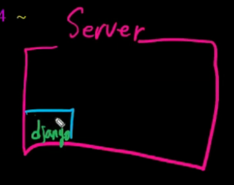

새로 분양받아서 이제 우리가 해야할 일을 해야하는데 대여를 받은 서버는 텅텅 비어있는 상태. 몸만 가서는 아무것도 없어서 사용할 것이 아무것도 없다. 따라서 대여받은 서버에 내가 사용할 물건들이 있어야 한다. 

이를위해서 내가 사용하는 컴퓨터에서 물건들을 가져가야 하는데 내가 현재 가지고 있는 것에서 필요한 것들만 분류해내기가 곤란하다.  안쓸 것을 가져가는 것도 결코 좋은 방법이 아니다... 

그럼 어떻게 해야하느냐?? 필요한 메뉴별로 필요한 것들만 모아놓는 것 아메리카노를 만들려면 이에 필요한 것들만 뽑아오고, 라떼를 만들려면 이에 필요한 것들만 뽑아오는 방법. 이것이 파이썬에서 말하는 가상환경(venv)라고한다.

따라서 프로젝트마다 거대한 파이썬에서 프로젝트에 핵심 기능,재료만 가져와서 별도로 생각을 하자. 프로젝트마다 다른 가상의 Python(pip)을 사용하는 것

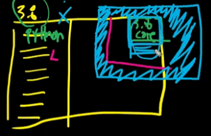

### 1.2 왜 web을 쓰는가

우선 편리하다. 많은 사람들이 접근하기가 용이하다.

127.0.0.1:8000 은 모든 사람들이 접근이 가능한가?? 아니다. '127.0.0.1'은 IP를 의미한다. 모든 컴퓨터는 이러한 주소값을 가진다.

컴퓨터에서 컴퓨터에서 요청을 보내게 된다. `URL 주소:port /path`방식으로 다른 컴퓨터에게 요청을하게된다.

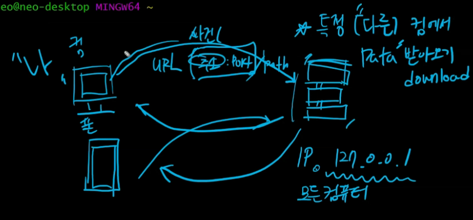

127.0.0.1은 '나'를 의미하고 나의 주소를 말한다. 그렇다면 127.0.0.1:8000은 자문자답과 같은 느낌인거임. IP주소는 자연스럽게 노출이 된다. 문제는 현관문이 열리면 안되는 것(다른사람의 요청을 컷해야 한다는 것)

다시 돌아와서 다른 서버에서 정보를 가지고 오려면 생각해보다 해야할 일이 많다. 그래서 내 컴퓨터가 서버의 역할을 할 수있는지 확인을 하기 위해서 로켓홈페이지처럼 확인을 해본 거임. 즉, 같은 컴퓨터 안에서 내가 클라이언트면서 내가 서버인 상황으로 확인을 해보는 것임.

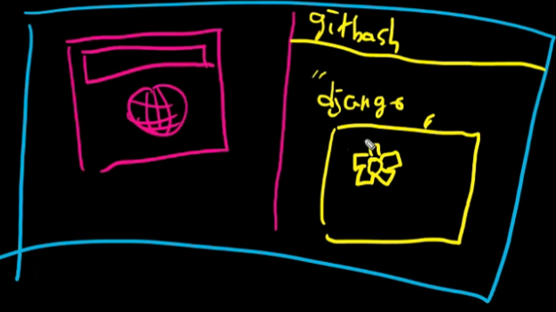

응? 그러면 google.com은 IP가 아닌데 뭐지? 이것은 '도메인'이라고 하는데 IP는 필요하나 사용하기 너무 까다롭다. 따라서 사람들의 사용성에 따라서 만들어진 것이 도메인. 하지만 필수적인 요소는 IP인거지 도메인은 IP에대한 접근성을 높여준 방식이라고 생각하면 됨. bash에서 확인해보면 google.com 도메인은 결국 216.58.197.14:443과 같은 것이다.

**모든 것은 서버에 접근하기위해서는 `IP:port`형식으로 접근을 해야한다.** IP, port 두가지가 있어야만 요청이 가능하다. port는 기본적으로 기본값이 적용되어있다.(https는 443, http는 80)

port는 무엇인가. 사용자가 접근하는 여러가지 항구(기능에 따라 나뉘어져있는 접근점).

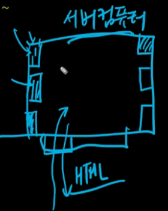

127.0.0.1은 IP 8000은 port(항구)를 의미한다. 여기서 8000 django 서버프로그램이 기본적으로 8000으로 접근하도록 설계가 되어있는 것(수정이 가능) 

## 2. django 프로젝트 만들기

### 2.1 가상환경(venv)

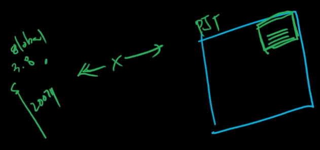

하나의 프로젝트를 진행하기 위해서 본인만의 python을 필요로 한다. 여기서 python은 가상환경 상에서의 python을 의미한다.

현재 python 을 해보면 이 python은 global에 있는 python을 의미한다. 어디있는지 물어본다면

이제 가상환경을 만들어 본다. `python -m venv venv` 명령어를 입력(파이썬아`python` 일을할건데`-m` 가상환경을 만들거야`venv` 가상환경이름은 `venv`야)

이것이 가상환경을 만든 것이다. 그러면 여기서 위치를 찾으면 무엇이 될까?

아직 글로벌과 가상환경을 분리하지 않았기 때문에 그대로 global python이 나오게 된다. 이제 분리를 시켜주기위해서 `source venv/Scripts/activate` 명령어를 주면 가상환경(독립환경)을 활성화하게 된다 

위에 (venv)가 보이게된다. 지금부터 이 터미널에서는 현재있는 주소의 터미널에서 사용하게 된다. 두개의 차이를 확인해보기위해서 `pip list`를 해보면 구성되어있는 내용물을 확인가능하다.

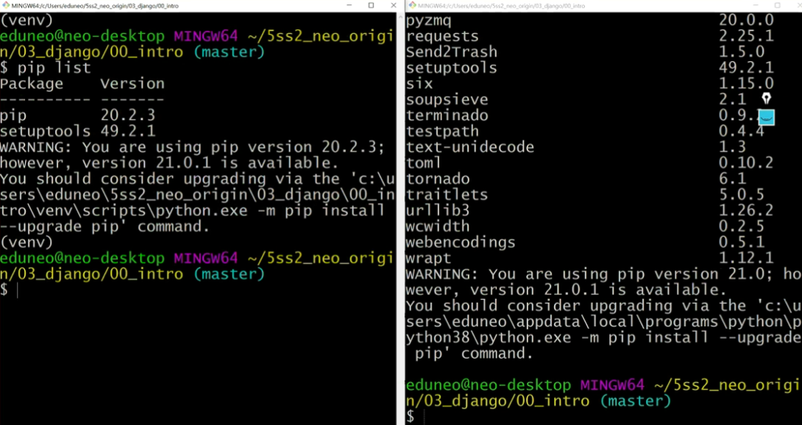

 가상환경은 완전 새삥이라서 django를 받아줘야함. `pip install django`를 해준다.

`django-admin startproject 프로젝트이름` 을 통해 새로운 프로젝트를 생성하고 vs code를 열어준다. 열어보면

이런 문구를 볼 수있는데 이것은 venv의 library에 너무 많은 파일들이 들어가 있기 때문. 

이처럼 너무 많기 때문에 반드시 `.gitignore`가 필요하다. venv폴더를 통으로 무시하는 파일이 반드시 필요하다. 프로젝트 안에 venv와 같은 위치에 `.gitignore`파일을 만들어 주고 gitignore.io에서 문구들을 가져온다.

venv에서 `pip list`에 있는 내용물이 앞으로 필요한 것들이기 때문에 이것들을 저장해놓을 `.txt`를 하나 가지고 있자. 설치할 것들 적어놓고 나중에 설치해주면 된다. 하지만 언제 일일히 이러고 있음

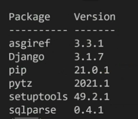

`pip install -r 설치할것들.txt` 을 통해서 받아와 주면 된다.

이렇게 나중에 설치할것들을 약속으로 requirements.txt가 국룰.

### 2.2 django프로젝트 만들기

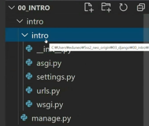

intro라는 폴더가 중복되어있는 것을 없애고 싶다.

위에 하나 intro는 없애고 프로젝트를 진행하고 싶다! (새로운 폴더를 만들어서 압축해제가 아니라 여기에 압축해제 느낌)

일단 망해버린 프로젝트 없애버리고 싶다? `rm -rf 프로젝트이름` 을 해서 지워버린다.

`pip freeze`를 통해 현재 버전을 완전히 얼려버린후 출력

`pip freeze > requirements.txt` 출력을 그대로 텍스트 파일에 받아 적어라.

`django-admin startproject intro .`을 통해서 압축해제를 한 다음 프로젝트를 만들어 주겠다!

### 2.3 정리

- django 프로젝트

1. 프로젝트를 생성하려는 디렉토리에서 `git bash`
2. 빈폴더(프로젝트 Root)를 만든다.
   1. `.gitignore` 생성
   2. `$ git init` 으로 REPO 초기화
   3. `README.md` 생성
   4. 원격 저장소 생성 후 연결
   5. `add` => `commit` => `push` 
3. 해당 폴더로 이동해서 `$ python -m venv venv` 명령어를 통해 가상독립환경 폴더를 만든다.
4. 가상독립환경을 활성화(`$ source venv/Scripts/activate`)한다. (or vscode 로 열기) 
5. `$ pip install django (+ a)` 를 통해 필요한 패키지들을 설치 한다.
6. `$ django-admin startproject <PROJECT NAME> .` 명령어를 통해 프로젝트 초기화
7. 프로젝트 vscode로 열어서 진행

- 프로젝트 열기

반드시 프로젝트 Root 폴더 => 우클릭 => Code로 열기

- 프로젝트 독립환경 설정

1. `ctrl` + `shift` + `p`
2. `>python: Select Interpreter` 입력
3. 자동으로 가상환경 폴더(`venv/`)안의 python을 잡지 못한다면
   1. `Enter interpreter path` => `find` => `venv/Scripts/python` 을 선택
4. 완료 이후 좌하단에 `Python 3.8.x 64-bit('venv')` 문구를 확인
5. 터미널 프롬프트에 `(venv)` 반드시 확인 후 진행

## 3. django

django는 여러가지 app들의 모임

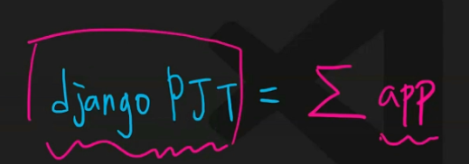

django프로젝트 기반을 만들었다면

`python manage.py startapp articles`를 만들어준다. startapp은 mkdir과 같다.

intro만큼은 조금 특별한 앱(`settings.py`파일이 있음) 이것을 앞으로 'master app'이라고 하자.

### Design Pattern

알고리즘이 '사격술'이라면 디자인 패턴은 '전략'으로 볼 수 있다. 좀 더 숲을 보는 개념

view에서 좀 더 알고리즘적으로 함수를 어떻게 더 효율적으로 코드를 짜는 접근 보다는 설계자 메서드, 모델, 뷰는 어떻게 분리할지에대한 접근방법

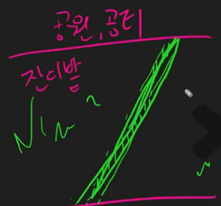

선배님들이 깎아놓은 많은 사람들이 만들어놓은 접근법. 많은 사람들이 웹, SW개발이라는 같은 목적지를 다양한 방법으로 시도했는데 그 중에서 가장 효율적이었고 좋았던 방법이 바로 MTV 설계방식. (해보니까 이게 낫더라~) 수 많은 삽질들의 결과가 MTV(Model Template View), MVC(Model View Control)

### 설계개념

- `urls.py` : 요청(저 이거하고싶은데요)을 받고, 그것을 포워딩해주는 역할

  저기요 저는 뭐를 원하는데요(URL/articles/index) => 그래요 제가 해드릴건없고 저기로 가셔야됩니다.

  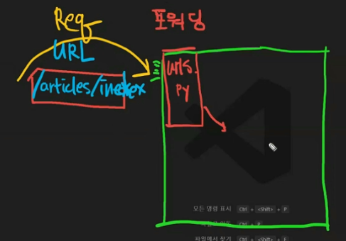

- `views.py` : 넘겨온 일을 하는 것(작업하는 공간)

  1. urls.py로 부터 넘겨받은 작업을 하고
  2. 작업한 것을 다시 반환하는 것(HTML)

  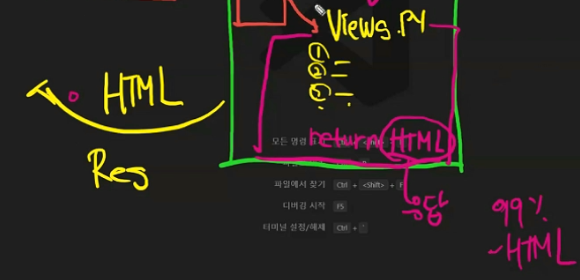

---

이번에는 좀더 범위가 넓어졌을때(통상적으로 django 범용적으로 사용되는 경우)

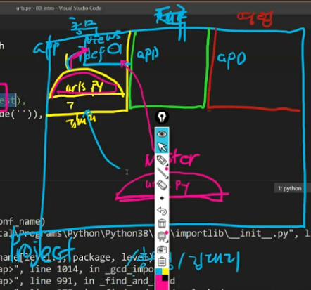

앞에서는 urls.py에서 바로 일을 시키는 경우였지만 이번에는 마스터 url에서 지정만 해주는 것

- `urls.py`

  

  articles라는 url이 들어오면, 나는 모르겠는데 특정앱이있으면 그곳으로 보내겠다(`include`) 그곳으로가면(articles.urls) 거기서 원하는 것을 해줄 것이다는 의미.

- `articles.urls`생성

  생성만 하고 실행하면 articles.urls파일을 봤는데 그거 주소는 이거고 근데 이거는 **아무 패턴도 안보인다는 에러**가 나온다.

  

  패턴이 없으므로 패턴을 만들어준다

  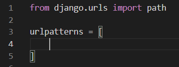

  남은건 이제 일을 시켜주는 일만 남았다.

### 기본로직

urls.py의 목적은 url을 받아서 포워드해주는것. 하지만 아쉽게도 forwarding이라는 함수는 없기에 이러한 역할을 해주는 path를 사용. path의 인자는 두개가 있다.

1. **들어오는 url의 패턴** : IP:port 뒤에 오는 부분

   ex) /test/....

2. 받은 url을 보낼 장소 : url을 받아서 그것을 보낼 곳과 보내서 실행할 함수를 지정(경로)

   ex) 위에서 /test/라는 것을 받았다면 test의 내용을 ~로 보낼 거다.라는 의미 그래서 결국 장소에서 특정함수를 시작해라

   

   `map(int, input())`과 같이 함수의 인자로서 들어오는 함수이기 때문에 여기서 `views.test()`라고 하면 안된다. **적절한 때가 온다면(test/를 받을때) views.test를 실행한다.**

---

사용자에게 Response를 줄때 99%는 아래와 같은 hoi가 아니라 html로 제공이 된다. 그렇다면 이것들을 따로 묶어서 Template으로 만들자(사용자에게 괜찮은 결과물을 return하자)

함수내부에서 하는 것이 바로 `views.py`에서 하는일

---

## 용어정리

`which django-admin` : django-admin이 어디에 위치해 있는가 확인

`django-admin startproject 프로젝트이름` : django프로젝트를 생성. 프로젝트이름은 구분을 위해서 앞으로 대문자를 사용해서 만들 것.

