# new_note

## 210120 Wed

- 입력은 모두 string으로 받는다

### 질문

1. 

   ```python
   while input() != '안녕':
       print('안녕할때까지 인사할게요')
   # 안녕이라고 치기전까지 print문구가 계속나오게 하려면..?
   ```

2. 

   ```python
   num = input()
   x = len(num)
   while x > 0:
       print(num[x-1])
       x -= 1
   # 다른 방법도 궁금합니다..!
   ```

## 210121 Thrs

- ```python
  '185'[-1] == 5
  '185'[-2] == 8
  ```

- workshop 1

  ```python
  # 상수는 대문자로 써보자!
  N = 10
  for i in range(1, N+1):
      if N % i == 0:  # 괄호 밖에서는 연산자끼리 띄운다.
          print(i, end = '')  # 괄호 안에서 연산자끼리 붙인다.
  ```

- whorkshop 2

  ```python
  # sort()는 함수 => 리턴이 있다.
  # sorted()는 메서드
  sorted((2, 1, 3))
  # [3, 2, 1].sort()는 가능 하지만 return되질 않는다. 3,2,1이 1,2,3으로만 바뀌기만 한 것. 
  # 따라서 x = [3, 2, 1].sort()
  # x.sort() 이 경우엔 이런식으로 풀어야됨
  
  # (1, 3, 2).sort()는 불가능
  ```

- homework 홀수만 담기

  ```python
  range()
  ```

- for문으로 1~5까지의 합

  ```python
  total = 0
  for num in numbers:
      total += num
  print(total)
  ```

- while문으로 1~5까지의 합

  ```python
  total = 0
  idx = 0
  while x < len(numbers) :  # while x <= len(numbers) - 1 대신에 사용 된다!!!!
      total += numbers[idx]
      x += 1
  print(total)
  ```

- `enumerate` 이따보자
  
  - id개념정리필요
- 이제 따로 hw파일 업로드 안해주시니 submission 폴더에서 jupyter notebook하고 본인이 새로 만들어서 정답만 적어 두는것으로 연습하자.
  - ex) python_03_homework.ipynb
  - ex) python_03_workshop.ipynb
- result를 def위에 쓰는 경우
  - local에서 print는 가능하다 == 보는 것은 가능하다
  - 하지만 return(반환, 변형)은 불가능하다. 변경은 불가능 하다.

```python
#평가 예
#정수로 이루어진 리스트 arr의 총합을 반호나하도록 p1을 작성하시오.

def p1(arr):
    return sum(arr)

p1([1, 2, 3]) # 6
p1([1, 2, 3, 4]) # 10
p1([1, 2, 3, 4, 5]) # 15
```

- 리스트/ 딕셔너리 접근 [0], ['key']
- for/while
- 함수 정의(in/out)
- 재귀를 만든다.

- **공지사항**
  - 온라인 학습기간 참여 : 학사사이트 팝업창 통해서 들어와야 합니다.
  - 웹엑스 : 강의 제대로 잘 듣고, 호응
  - 온/오프라인 : 2단계는 온라인유지 1.5단계는 국가 규정에 따라서 정해짐. 최소 2주전에는 공지가 올라갈 것 입니다.
  - 건강설문 : pc방 스탠딩공연장 노래방 주말여행 ... 자제해주세요
  - 월말평가 14~16시(2시간) 공지사항 반드시 확인(부정행위 관련)
    - 월말 3/5 과목 6/10
    - 커트기준 60점 하지만 잘 보셔야 합니다.
    - 파일명 지정. 빈파일 x. 문항 예시 실수로 올리면 안됩니다. 시간 관리
    - 16시 ~ SSAFY 데이 : 기프티콘, 반 응원
    - 캡쳐화면방지 프로그램 반드시 설치하세요
    - 평가 10분전 webex url제공됨
    - 연습지는 검사 받고 사용가능
  - 보충수업 8회 1시간 30분동안 진행됨.
  - 자바 - 원하신다고 갈 순 없습니다. 하지만 시험 잘 보면 가능할수도있음
  - 모바일 응시불가. 되도록이면 크롬에서 설정

## 210122 Fri

### 관통프로젝트(Project)

- 관통 프로젝트(매주 금요일마다, 총 10번의 프로젝트)
- 일정한 목적 달성을 위한 요구사항들을 수행
- 월~목까지 수업했던 내용을 정리하는 것, 복습, 학습을 마무리 하는 시간
- 배울 '**학**' 익힐 '**습**'
- 필수 함수 형성이 목표!

- **시험공부한다 생각하고 하나하나 이해하면서 진행하자**

  - 남의 코드 베끼는 것은 도움이 되지 않는다.
  - 삽집... 메모... 를 하면서 실력이 늘것

- 점심시간 이후에 git lab에 업로드 해주심

- 목표

  - 기본 문법 실습
  - 파일 입출력에 대한 이해
  - 데이터 구조에 대한 분석과 이해
  - 데이터를 가공하고 JSON 형으로 저장

- 영화 데이터를 뽑아서 정렬, 새로 구조

- 오늘은 총 5개의 파일을 수정할 것입니다.

- 프로젝트 명세에서 가장 중요한 것은 '요구사항'

- 딕셔너리 : 자료를 모아놓음, 데이터를 구조화 해놓은 자료구조

  - 결국 dict, josn 의 목적은 key value를 담기위한 목적은 같다.

- 반드시 활용한 데이터 정보 정리 및 저장한 파일ㄹ에 대한 설명과 학습 내용을 README.md에 기록하여 제출

- gitlab에 제출하는 파일/폴더의 구조 : 아래와 같습니다.

  - pjt01/
    - data/
      - README.md
      - problem_a.py
      - problem_b.py
      - problem_c.py
      - problem_d.py
      - problem_e.py

- Git

  - 버전관리(현재 우리가 이런 용도로 이용하고있쥬?), 협업(나중에 곧 활용할겁니다)

- 제출방법

  - `git clone https://lab.ssafy.com/05/a/projects.git`
  - `git init`: 이 파일을 관리 할꺼야. .git이라는 폴더를 생성
  - README.md git ignore.md 2개 파일을 무조건 먼저 생성한할건데
    - `touch .gitignore`: 만들어지면 파일의 왼쪽에 git마크가 만들어져있음 여기에 우리가 원하지 않는 파일을 넣을 수 있다.
      - 사용은 코딩창에 쓰고싶지 않은 파일 예를들어 problem_a.py이렇게 쓰면 ignore된다.
      - *.txt라고 적으면 확장자가 txt인 파일 다 안넣는다 처럼 사용도 가능
      - git.ignore.io 사이트 들어가서 우리가 사용하는 언어,os .. 예를들어 python, vscode, window 검색해서 복사하고 코딩창에 붙여넣기
      - 이렇게 함으로써 add준비가 된것
    - `touch README.md` : '나좀 읽어줘'인데. 설명서로 생각하면됨 우리는 뭘 읽게 해주냐
      - 이 프로젝트 나중에 볼 때 이해할수 있도록
      - 다른사람이 볼때 내가 이 프로젝트를 통해 무엇을 배웠는지 보여주는 용도
        - 예시를 들자면, 일기처럼 의식의 흐름으로 내려가는 방식, 개요(사진사용)/#후기(뭘 배웠는지)#
      - 새로배운점, 어려운점, 스스로의 피드백, 잘한 점, 못한 점
      - 앞으로의 우리들에게 많은 도움을 줄것.(포트폴리오, feedback)
      - 깔끔하게 정리한 습관을 들이자
  - `git status`: 현재 git의 상태를 알려줍니다.
  - `git add .`: 현자 폴더에 있는 모든 파일, 폴더를 한번에 스테이징
    - working directoty에서 staging area로 add 하게 됨
    - `.`은 뭘 의미하는가.
      - ls명령어에는 data
      - ls -a에는 . .. .git 이런것들이 나오는데 이런것들은 숨김 파일, 폴더라는 것
      - 결국 `.`은 현재 내폴더 그리고 그 하위 폴더까지 `..`은 상위 폴더
    - Warning: LF 뭐시기가 나오는데 warning은 ''주의'' LF(Line Feed)가 CRLF(Carriage Return Line Feed)로 replace 되는것
      - LF : 한번 내리는것(내려쓰기)
      - CRLF : 오른쪽으로 가고 한번 내리는 것(내려쓰기)
      - warning을 굳이 해결하고자하면 #window git CRLF를 검색하면 `git config --global core.autocrlf true`를 입력
  - `git status`: 현재 git의 상태를 알려줍니다.
  - `git commit -m '메시지를 입력'`
    - staging area에서 .git에 저장
  - git lab 사이트에 들어가서 새프로젝트를 만듭니다. 이름은 `pjt01` 으로 생성 후 create project
  - `git remote add origin '사이트 주소'`: git올려야 하는 주소좀 알려줘
  - `git push origin master`: origin에 master를 올릴게
  - 권한설정
    - 설정 -> 회원 -> select members to invite쪽에 교수님 추가 -> choose a role은 maintainer -> add ro project

#### pjt01 실습예시

- music.json을 활용(파일을 불러와라! # python file io(입출력0)검색 -> 공식문서 docs.python.org에서 확인)

  ```python
  # 파일을 읽고 쓰기 (docs 7.2.)
  # open()이라는 함수를 사용. 두 개의 인자를 주는 방식
  # open()은 내장 함수
  # 위치가 우선순위인 인자 위치인자(기본값을 우리가 직접 정해줘야함)
  # mode = 'r' 처럼 기본값이 정해저 있는 것은 기본값 인자(필수는 아니지만 우리가 안넣으면 정해진 기본값이 나오는 인자)
  기본적으로 open(file)을 하게되면 파일이 열린다!
  open('music.json')  # 현재 music.json은 내가 불러오려는 위치와 같은 장소에 없다.
  open('data/music.json')  # data라는 폴더안의 musiic.json파일을 가져온다.
  
  music_file = open('data/music.json')
  print(music_file) #=> <_ioTExt.. name = 'data' mode = 'r'> 이는 단순히 파일을 연 것
  # 파이썬 내부에서 사용할 수 있는 dict변환으로 시켜줘야함(# python json to dict검색 -> basic Usage -> json.load)
  # json.dump는 dict -> json
  # json.load는 json -> dict(json을 파이썬 객체로 바꿔준다.)
  import json
  json.load(music_file)
  music_dict = json.load(music_file)
  print(music_dict) #=> error cp949 발생->검색해보니? with open('m.json, encoding='utf-8')
  # 파이썬 내부 확장자 형태로 바꿔줘야한다.
  music_file = open('data/music.json, encoidng='utf-8) 로 수정
  # 다시 실행해보면 실행 됨(dict구조로 파일이 출력 된다.)
  # 진짜 dict인지 type()을 통해서 확인을 해봐야한다.
  ```

  

- 제공되어있는 데이터에서 singer, title 정보를 가져온다. 정보를 dict를 반환하는 함수를 작성한다.

  ```python
  # 참고
  import pprint  # pretty print 예쁘게 출력해줄게
  pprint.pprint(music_dict)  # 결과를 예쁘게 출력해주는 기능
  # 이제 정보를 가져와보자
  # value에 접근하기 위해서는 키로 접근한다!
  # 방법1 : []
  singer = music_dict['singer']
  title = music_dict['title']
  print(singer, title)
  # 방법2 : 안에있는 도구를 활용(메서드)
  album = music_dict.get['album']
  # 차이는 []로 접근했을때 안에 자료가 없으면 error
  # get은 자료가 없을때 return을 해준다. none을 return해준다. none은 true false활용가능
  
  # 이제 가져온 정보를 새로운 dict로 반환하는 함수 music_info를 완성합니다.
  # 제공된 데이터를 함수에 넣어서 반환해야한다.
  def music_info(music_dict):  # 일반적으로 보낼것과 받을것 이름은 동일한 것이 좋다.
      singer = music_dict['singer']
  	title = music_dict['title']
  	music_info(music_dict)
  # 새로운 dict에 넣어야 한다.
  # result라는 변수를 만들어서 그 안에 새로운 결과를 넣어준다. #
  def music_info(music_dict):
      
      result = {}
      singer = music_dict['singer']
  	title = music_dict['title']
      
      result['singer'] = singer # singer라는 키의 value값에 singer변수를 집어 넣겠다는 의미
      result['title'] = title
      
      return result
  
  pritn(music_info(music_dict))
  ```

- 초반 정리 :파일을 불러와서 번역하고 그 파일을 변형시킴

  

  - import는 위로 올린다!

  - 작성된 코드에는 주석을 달면서 복기하자

  - ```python
    #스텝을 정리해보면
    # data폴더 안에 들
    ```

  - 월말평가에서도 코드에 상세하게 주석을 남겨놓자

- 이번에는 여러개의 자료가 들어가 있는 musics.json을 가져와보자

  ```python
  # list상태의 자료를 가져와보자.
  import json
  # data폴더의 musics.json파일을 가져오자. 인코딩도하자
  musics_file = open('data/musics.json', encoding='utf-8')
  # json을 변환!
  musics_dict = json.load(musics_file)
  # 추출로 잘 왔나 확인
  # print(musics_dict)
  # print(type(musics_dict) # 타입도 확인해본다 => list
  
  def music_info(musics_list):  #musics_list인자를 받음
      result = []
      for music in musics_list:
          info = {}
      	singer = music.get('singer')
          title = music.get('title')
  		info['singer'] = singer
          info['title'] = title
          
          # result.append(info)
          result += [info]  # dict형태의 info를 []로 감싸서 더해준다
          				  # 하나의 딕셔너리를 리스트의 요소로 넣어서 각 리스트들을 다 더한것
              			  # info가 합해진다기보다 둘이 연결된다고 이해하면 좋을 듯
      return result
  music_info(musics_list)  #musics_list를 호출
  
  ```

  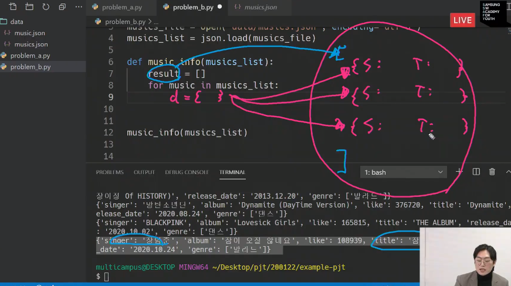

### 시험공지, 예제풀이(월말평가)


- 오늘 pjt한 형태로 나올 것

- pdf py파일이 제공됨 문제에서 요구하는 파일을 수정하면 됨

- error exception파트는 제외

- 내장함수는 웬만하면 사용하지 않고 코딩한다고 생각하면 됨

- practice, homework, workshop 문제들을 되짚어 보는게 좋습니다.

  - 함수 선언, 호출
  - 선언하는 부분에 대한 구조, 로직

- edussafy들어가서 파일을 다운로드받습니다. 

  - 압축파일, 명세파일

- 제출방법

  - 월말평가라는 폴더를 `압축`해서 보내야한다.
  - 우클릭 후 보내기 -> 압축폴더 -> 이름은 `서울_2반_김명준`이렇게 압축한다.
  - 업로드는 깃으로 하는 것은 아니고 ssafy 사이트에 제출

- ```python
  # return이 있어야 반환을 합니다.
  # 최고점 예시 풀어보면
  def max_score(scores):
  #풀이 1 : max함수
  	return max(scores)
  #풀이 2 : 하나하나 돌면서 비교
  	result = 0
  	for score in scores:
          if score > result:
              result = score
      return result  # 아니면 result를 리턴
  ```

- ```python
  # 전체 점수 중 60점 이상인 과목의 개수
  def over(scores):
      # print(scores)로 어떤 scores가 오는지 확인
      count = 0
      for score in scores:
          if score > 60:
              count += 1
      return count
  ```

- 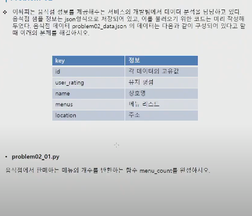

- ```python
  # 음식점에서 판매하는 메뉴의 개수를 반환하는 함수를 완성
  # menus key의 value값이 필요하다
  # 방법 1
  def menu_count(restorant):
      menus = restorant.get('menus')
      count = 0
      for menu in menus:
          count += 1
      return count
  # 방법 2
  def menu_count(restorant):
      return len(resorant.get('menus'))
  ```

- 

- ```python
  #list 안에 list요소들이 들어 있는 경우(2차원 배열)
  # [[9, 3], [9, 0]]
  # 여기서 최고는 최고끼리 최소는 최소끼리 모으는 방법
  def turn(temperatures):
      # print(temperatuers)를 해서 내부에 뭐가 들어있는지 확인해보고 시작하자
      # []요소들로 이루어진 []
      for temperature in temperatures:
          print('최고기온', temerature[0])
          print('최저기온', temperature[1])
          # 추가적인 리스트를 생각해보자
  ```

- ```python
  def turn(temperatures):
      maximum_temp = []
      minimum_temp = []
      for temperature in temperatures:
          # print('최고기온', temerature[0])
          # print('최저기온', temperature[1])
          # 추가적인 리스트를 생각해보자
          maximum_temp += [temperature[0]]
          minimum_temp.append(temperature[1])
      result = {}
      result['maximum'] = maximum_temp
      result['minumum'] = minimum_temp
      return result
  ```

- 정리 

  - PJT01 -> git /월말평가 -> edu ssafy

### 관통프로젝트(실습)

#### 1. git절차

- git init

- touch .gitignore

- touch README.md

- git add .
- git commit -m 'fdsa'

- git remote add originhttps://lab.ssafy.com/aud1132/pjt01.git

- push

## 200123 Sat

### 함수

#### 개념

- 함수는 일을 하는 방법을 정리한 값

- 기본 형식

  ```python
  def func(n):  # func라는함수에서 변수n을 다룬다. n은 인자를 받을 준비
  vvvvreturn n + 2 # 변수를 다루고 나서 n + 2값을 반환한다.
  func(2)  # func함수를 호출하고 n이라는 인자에 2를 전달한다.
  ```

- `print` vs `return`

  ```python
  def func(a):
      b = a + 2
      print(b)
  func(2)  #=> 4가 출력된다.
  print(func(2))  #=> None을 반환받았기 때문에 None이 출력된다.
  
  def func(a):
      b = a + 2
      return b
  func(2)  #=> 아무것도 출력되지는 않지만 b를 반환받은 상태
  print(func(2))  #=> b를 반환받았기 때문에 b값이 4가 출력된다.
  ```

- return은 오직 한개의 개체만 가능하다.

  ```python
  return a, b ##=> 이경우는 (a, b)로 tuple한 쌍을 반환한 것.
  ```

- 아무것도 return하지 않으면 None이 반환된다.

- 정렬함수

  ```python
  a = [5, 6, 4, 2, 1, 3]
  a.sort()  # a원본을 변환
  print(a)  #=> [1, 2, 3, 4, 5, 6]
  
  sorted(a)  # a파일을 정렬해서 그것을 새로운 list에 담음
  print(a)  #=> [5, 6, 4, 2, 1, 3]
  print(sorted(a))  #=> [1, 2, 3, 4, 5, 6] 
  ```

- 인자

  - 위치인자 : 인자값을 받아서 사용되는 인자

  - 기본값인자 : 기본적으로 인자값이 정해져있는 인자

    - 기본값인자 뒤에 위치인자가 올 수 없다.

  - 키워드인자 : 직접 변수의 이름으로 특정인자를 전달

    ```python
    def func(name, age):
        return pass
    func(age=15, name='명준')
    ```

  - 가변인자 : 여러개의 인자처리, 매개변수 부분에 *표시

    ```python
    def func(*args):
        return args
    b = func('명준', '남호', '익주')
    print(b)  #=> ('명준', '남호', '익주')
    
    def func(*args, prof):
        print(f'교수님{prof}, args)
    func('유태영', '명준', '남호')  #=> 오류발생. 어디까지가 *args인지 알 수가 없다.
    # 이 경우는
    def func(*args, prof):
        print(f'교수님{prof}, args)
    func('유태영', '명준', prof='남호')  # 이런식으로 명명해줘야한다.
    ```

- ```python
  def get_secret_word(numbers):
      result = ''
      for number in numbers:
          result += chr(number)  # result에 number를chr로 변환한 것을 하나씩 추가
      return result  # result값을 반환
  
  get_secret_word([83, 115, 65, 102, 89])  #=> str형식의 'SsAfY'가 저장되어있음
  print(get_secret_word([83, 115, 65, 102, 89]))  #=> 실행시 SsAfY가 출력
  # 하지만 이것은 None이다. 출력하는 기능만 갖고있고, return받은 값은 없기때문
  ```


## 200125 Mon

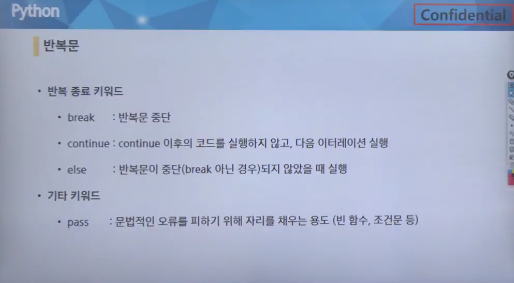

- break. continue. else
- 함수
  - 기본적으로는 위치인자를 갖는다.
  - 순서를 바꿔서 호출하는 것도 가능
    - 처음에 호출을 바꿔하면 그 이후에는 모두 이름을 붙여서 호출한다

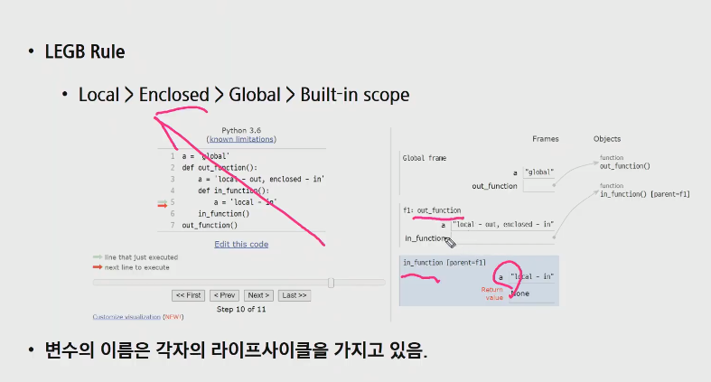

- Local > Enclosed > Global > Built-in scope

### 데이터 구조 및 활용

#### Today?

- 데이터형식.행동()
  - 'Hi'.lower()은 뭐가 될지?
  - [1,2,3].remove(1)은 뭐가될지?
  - [1,2,3].count(1)은 무엇인가요?
  - {'바나나'}.add('수박')
  - {'b':'banana'}.get('b')
- 데이터 형식에 맞춘 행동을 볼 것입니다.

#### 노트

- Python은 진입장벽이 낮다

  ```python
  # [1,2,3] 리스트에서 1을찾는다면
  cnt = 0
  for n in numbers:
      if n == 1:
          cnt += 1
  # 이것을 단순히
  [1,2,3].coount(1)로 쓸 수 있다.
  ```

- 오늘은 내장되어있는 메서드들을 읽어본다.
- 영어 원문으로 읽어보는 것을 사실 추천합니다.
  
  - 메서드 등 자료들을 찾아볼때
- 
  
  - []로 표시되어있는것은 선택적으로 사용가능
- 
  - print('1', '2', '3')이런식으로 넘겨줄수 있는것
  - dict(a = 'apple')이런식으로 넘겨주는 것

- 
  
  - isnumeric과 isdigit과의 차이
- 

- 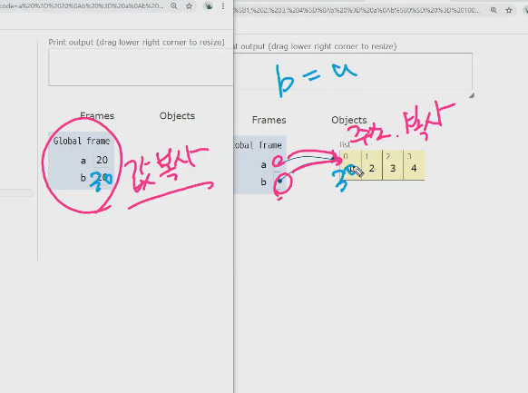
  - list는 같은 객체를 가리키기 때문에 하나의 요소를 변경하면 a, b 둘다 결과가 같다.
  - 신기한 스쿨버스 생각으로 따라와라
- 
  - 중요한 내용
  - 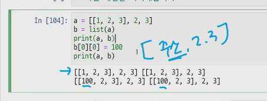
  - 
  - 이경우엔 deepcopy를 사용한다.
  - 

- 
  - 좌측은 리스트에 원소를 하나식 추가
  - 우측은 cnt를 1씩 올리기

- 

- 

- 

- 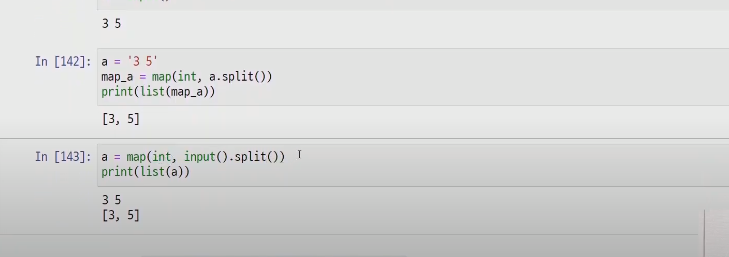

- 리스트의 요소의 형식을 변경해주는 세가지 방법

  

  ​	

- 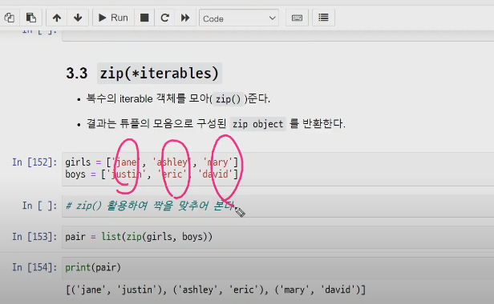
  
  - zip은 저렇게 하나씩 묶어준다.
- 
  
  - list 와 set의 차이
- 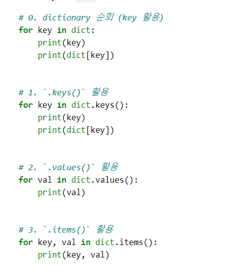

- 정리
  - 'Hi'.lower()은 뭐가 될지?
  - [1,2,3].remove(1)은 뭐가될지?
  - [1,2,3].count(1)은 무엇인가요?
  - {'바나나'}.add('수박')
  - {'b':'banana'}.get('b')

- 결국에는..

  ```python
  [1,2,3].count(1)  #이처럼 함수를 호출하는것
  데이터형식.행동()   # 이것을 '메서드'라고 한다.
  ```

- .pop() 제거하기 함수
  - list **(순서있음)**
    - pop()맨뒤
    - pop(idx)특정 index
  - set **(순서가없음)**
    - .pop() 랜덤
  - dict **(순서는 없는데 key, value쌍임)**
    - .pop(key)
    - key로 접근해서 pop하는 것
  - 각각이 자료형에 따라서 이해해보자.

#### 교수님시간

- list comprehension은 알고리즘에서 자주 사용하게 될거임.

- md(markdown), html wishwig하지 않다. 내가 치는 것이 그대로 보이지 않는다.

  - 노트북 파일조차도 사실은 딕셔너리

- return 없이 주어를 바꾸는 method

  - list와 같은 것

- **string은 주어가 바뀌지 않는 method => imutable**

  - .strip() .split() ... 이런 것들은 **새로 만들어서 바꾸는 것**
  - 원본은 남아있는다.

- .split()

## 200126 Tue

### 오전

- string은 고치는 것이 불가능하다. 

- 뭐가 다르게 쓰이는지 봅시다. 활용해봅시다 => 시험가능성

- copy deepcopy 시험내기 좋습니다.

  

- workshop 3번이 어렵

### 오후

- 모듈은 파일(또는 스크립트)이다.
  - 무슨파일이냐? 코드를 담고 있는 파일이다.
- 단어Convention
  - True, False 를 return하는 함수의 접두사 **'is'**


- 남이 짜놓은 코드들은 '라이브러리'

- 그 라이브러리들중에서 인증된 것을 설치하도록 도와주는 패키지 관리자(pip)

- 콘다는 뭔가요?

  - 스타크래프트 깔려서 온 컴퓨터

- 패키지는 파일들의 집합

- from, import 공부하는데 생기는 _ _pycache_ _라는 폴더..?

  - **package 폴더 안에 생긴다.**
  - 컴파일, 인터프리터 언어의 차이
    - 중간과정없이 실행이 가능하면 인터프리터다. 라고 생각하자 지금은
  - C는C파일을 실행할 수가 없다. 하지만 파이썬은 가능하다.
  - C는 컴파일이라는 작업이 필요하다.
    - gcc라는 컴파일에게 test.c라는걸 넘기면 사람이 읽을 수 없는 파일을 넘겨주고 test.program을 실행하게된다.
  - 파이썬은 인터프리터
    - 다른 파일을 빠르게 실행을 해주기 위해서 필요한 파일
  - 아니 그럼 이런거는 내가 원하지도 않았는데 생겨나면 git이 관리할때는 어떻하냐
    - **gitignore.io에서 python부분에 반드시 들어가게 되면서 git에서 관리를 할때 무시를 하게된다.**

- ```python
  if '__name__' = '__main__'에 대해서 알아보자.
  
  # my_package/neo/tools.py 경로인 상태에서
  # '남'/'나' 항상 실행
  def my_func():
      return 'Hello'
  
  # 나를 실행하면 실행되는 부분
  print('hi')
  
  
  ```

  - ```python
    from my_package import intro
    
    # hi가 출력
    # import만으로 한 번 실행된다는 것을 의미한다.
    ```

  - ```python
    from my_package.neo import intro
    my_func()
    # import하는 시점에 hi가 출력되고
    # error => func()안에 변수가 지정되지 않았음
    # 실행되는 과정을 알면 ok
    ```

  - ```python
    # 그렇다면 언제는 실행되고 언제는 실행되지 않는지 어떻게 할건가
    bash에서
    python package_practice.py를 실행할때
    이를위해서 만들어진 builtin함수 __name__
    print(__name__) # => __main__
    # 누가 나를 불렀어? 사용자가 불렀어! 라는 의미
    # __main__이 아니면 남이라는 것
    # 따라서
    if __name__ == '__main__':
    # 이 조건을 걸어주면 오로지 내 파일을 실행하고 남의 파일은 가져오긴하나 직접실행했을때 나오는건 나오지 않는다.
    ```

- git 사용

  - ```python
    #Total 117 (delta 2), reused 0 (delta 0), pack-reused 0
    #remote: Resolving deltas: 100% (2/2), done.
    #To https://github.com/edkim3275/TIL.git
    # * [new branch]      master -> maste
    # bash터미널에 이런식으로 나온다면 업로드가 된것 
    ```

  - add commit push까지 왔다

    

    이부분에서 21.01.26... 이부분이 commit -m '메시지'했던 메시지가 나온다.

    해당 파일이 당시 커밋했던 부분이라는 의미

  - stage에 올린 내용을 다시 내리고 싶다면?

    ```python
    git restore --staged <파일이름>
    ```

    스테이지에 내려온다고 내용이 없어지진않는다.

  - 사진 찍은 것을 지우고 stage로 내린다?

    ```python
    git reset h # help줄임말인데 도움말 같은것들이 나옴
    git reset 8f3239 #처럼 일부만 쳐주면 된다
    ```

  - 분장실 - 무대 - 사진첩이 있었는데 사진을 지우고, 무대를 지나서 기존의 분장이 남아있는상태

    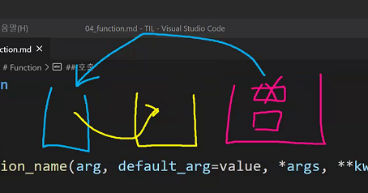

  - 그렇다면 분장실로 가는게 아니라 stage로 보내고 싶다면?

    ```python
    git reset --soft 33432fads
    ```

    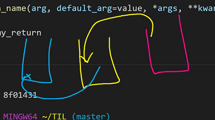

    이와 같은 것

  - 아예 과거로 돌아가고 싶다면??? (이건 위험위험위험)

    ```python
    git reset --hard 34235352
    ```

- 시뮬레이팅을 해봅시다.  ssafy컴퓨터에는 내 TIL이 없는데 그럼 어떡함?

- origin이라는 말이 무엇일까
  
- 
  
- https://scribbletogether.com/joi

- 

  branch 나누자 할때 그 기점을 복사하기 시작함

  

- 한번 합치자 할때이렇게 됨

- 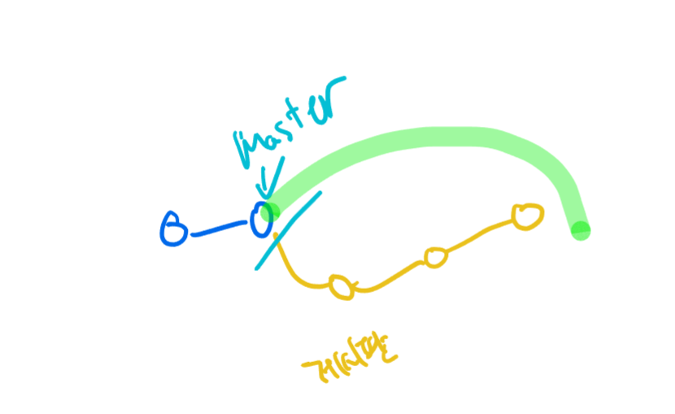
  
- 이처럼 하다가 망할 경우를 대비해서 master에서 branch를 뽑고 쭉 가다가 망하면 가지 잘라내고 하다가 잘되면 master와 합해준다.
  
- `git branch home-page` : 내가 가지 하나 만들겠습니다. 

  

  이러한 상태가 된다.

  

  가지를 쳐놓은 상태. 하지만 아직 점을 찍지는 않았음

- `git branch` : master에 불들어옴. 지금있는 master 보여주세요

- `git switch home-page`: 이제 가지 치고 점을 찍은 것!

  - `git checkout master`: 이것도 위 말과 같은말

- `mkdir pages`: home-page에서 pages 폴더생성

- `touch pages/home.md`: pages폴더에서 home.md파일 생성

- `git add .`  스테이징

- `git commit -m '1 . add home.md'` 커밋

- `git switch master` : master로 다시 돌아가보자!

  - master 상태로 다시 돌아간다.

  - 이것들을 표현해주는 것이. 내가 지금 어디있냐를 말해주는 것이 **HEAD**

  - 앞으로 HEAD는 '나'라고 보면된다.

    

    이러한 상태가 된다.

- 여기서 수정 후 다시 커밋을 하면

  

- 이제 중요 이 모든상황들을 master 상황으로 돌아가서 합쳐줘야한다.

  무엇을 병합이라고 할까

  master에 있던지 home-page에 있던지 같은 상황으로 만드는 것

  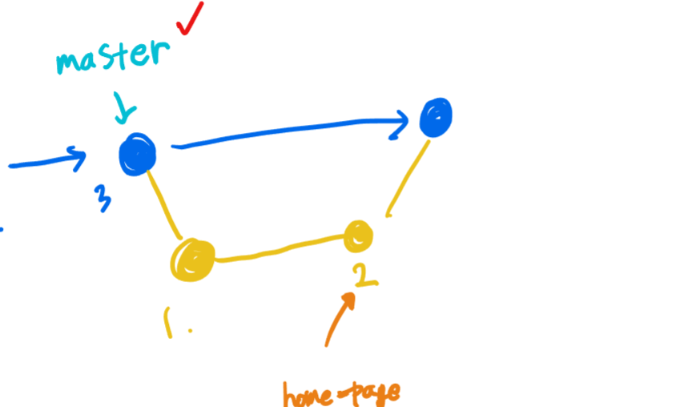

  이 상활일까???? Nope 

  

  만들어진 branch를 따라서 간다(꽃길만 걷는다.)

  이 명령어는

  `git merge home-page`: 이는 항상 master기준으로 해야함!!!!!!!!!!!

  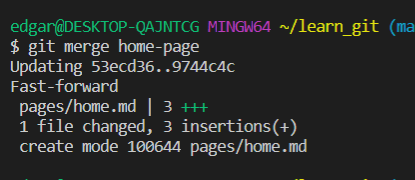

  1. Fast-forward가 빠른 길로 왔다는 것

- 끝난 branch는 삭제한다.

- `git branch -d home-page`:home-page를 삭제

  

- `git switch -c contact-page` : 가지를 만들고 점도 찍는다! (생성 전환을 한번에 같이해주는 명령어)

- 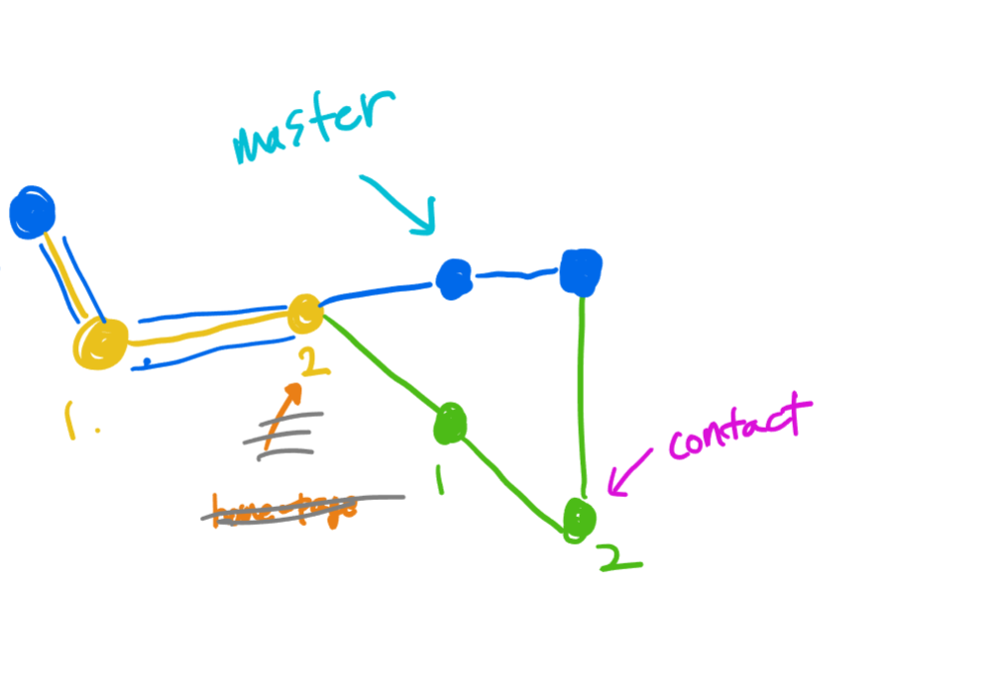

  두갈래길이 된 경우

  

  fast_award와는 다는 경과가 나온다.

  

  이런상황이 두 개의 커밋을 합치는 커밋을 찍어주는 과정

  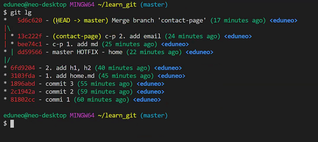

  결국 지금까진 그림처럼 코드로 확인이 가능하다(이건 따로 교수님께서 커스텀하신 명령어로 보신 것)

  `git reflog` log 짧게보기

- 합치기 이전

  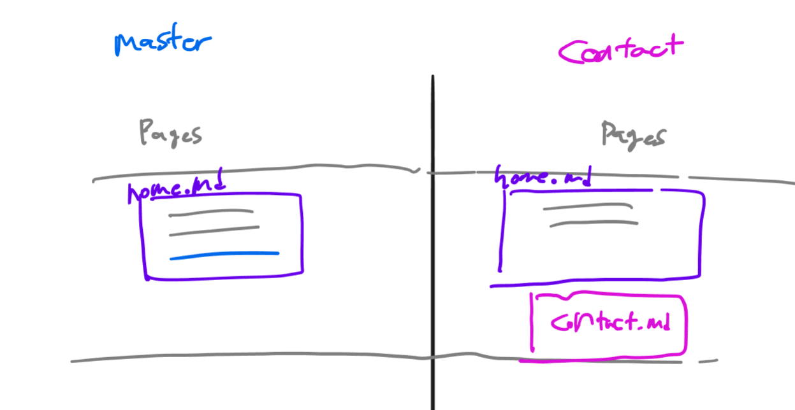

  이 경우 딱 들어맞는 상황이라서 auto merge가 일어났던 것

  하지만 이런 상황이 아니라면?? 딱 들어맞는 상황이 아니라면???

- `git switch -c about-page` 새로 만들어 주고

- `touch pages/about.md` md파일을 만들어본다

- `it commit -m 'a-p 1. create about.md'`  커밋하고

- 1.about 내용 한번 더 수정 해보고 2.home에 문자를 하나 더 넣어본다

- 이 때 2가지 수정사항이 한번에 일어났다.

- 이때 `git add .`으로 한번에 올려도 되지만

- `git add pages/about.md`하나를 올리고 `git commit -m 'a-p 2. add h1'` 한 후에 `git add pages/home.md ``git commit -m 'a-p HOTFIX home.md'`이 과정으로 따로 올려도 된다 그렇다면 현재상황은

  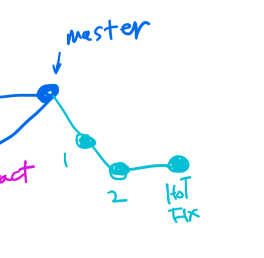

- 다시 원래 master로 돌아가서 home.md를 수정해본다.

- 현재 상황에서 

  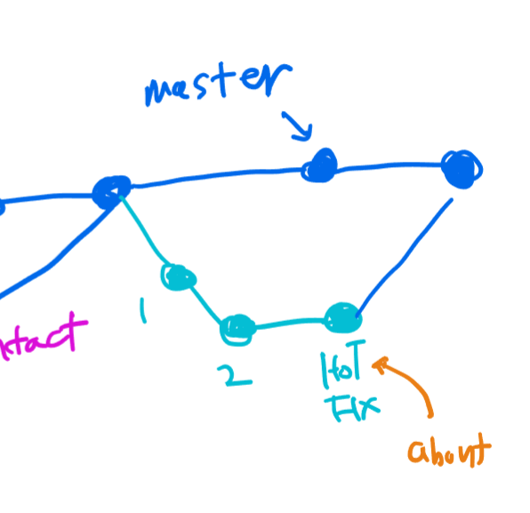

  원한느 모습은 이런데

- `git memrge about-page`merge해보고

- `notepad pages/home.md` 통해서 메모장을 수정하고 저장

- 일단 밑의 상황처럼master|MERGING 이 되고( 이것은 수정이 좀 필요하다는 의미)

- 

  

- 위에는 아직 커밋이 없다. 점이 안찍힘 수정을 모두 완료하고 나서?
- `git commit -m 'merge conflict'
- 


 `git branch -d about-page contact-page  ` 이제 모두 합했으면 가지들을 자른다.

- 금일 이미지 정리

  


## 200127 Wed

### 오전

```python
my_lower('HI')  # 함수의 인자 'HI'
'HI'.lower()  # 문자열을 소문자로 변형
#S  +  V 형식으로 코드가 짜여짐

sorted([3, 2, 1])
[3, 2, 1].sort()
#   S	+   V
```

- 지금까지는 절차 지향 프로그래밍

  

- 오늘 배우는 객체 지향 프로그래밍

  

- 용어

  > `type`: 공통 속성을 가진 객체들의 분류(class)

  > `class`: 객체들의 분류(class)를 정의할 때 쓰이는 키워드

- `self` : 함수를 호출 할때(인스턴스의 메서드를 호출하면) 파이썬이 내부적으로 인스턴스 자신이 전달되도록 설계되어있다.

  

- 인스턴스 메서드

  - 인스턴스가 생겨날 때 함수안에있는 로직들로 인스턴스의 값, 속성등이 조정이 됨

- 

- 

- 

- 10시
- 


- 

- 
  

  - 클래스 자체(`cls`)와 그 속성에 접근할 필요가 있다면 **클래스 메서드**로 정의한다.
  - 클래스와 클래스 속성에 접근할 필요가 없다면 **정적 메서드**로 정의한다.


### 오후

- 참고 : 객체지향의 사실과 오해

- ```python
  ### 교수님시간 ###
  a = 1
  def f():
      pass
  f(1)
  # 얘네들은 공공재의 느낌
  
  # 하지만 보통 무언가는 무언가의 소속이기마련
  # 행동목록과 소유목록
  name = '김명준'
  email = 'egkim3275@gmail.com'
  job = 'teacher'
  
  def code():
      pass
  def eat():
      pass
  # 이상태는 다 따로노는 상태
  
  # 그나마 유사한건 dict인데
  {
      name = '김명준'
      mail = 'eddfnk'
      job = 'teacher'
  }
  
  # 만약 사람이 더 많아 진다면??
  # 딕셔너리에 다 추가하면 되는데
  # 더 큰 문제는 ? 각 요소에 마다 행동을 적용시켜야한다는점
  # 이것을 묶어보자하는 생각
  
  
  
  # 기존의 코딩의 '현실세계에 대한 반영'의 문제때문에 기저에 대한 고민
  # 현실세계를 표현할 방법이없을까 때문에 나오게 됨
  ```

- 


- 피조물이 먼저 특성을 만들때 
  - 엘프는 활을 쏜다.
  2. 엘프는 고기를 먹지 않는다. 이렇게 지었다.

- 그리고 나서 

  - 레골라스는 활을 쏜다
  - 세레나는 고기를 먹지 않는다.

- 이렇다는 것은

  - (나의 피조물)은 활을 쏜다.
  - (나의 피조물)은 고기를 먹지 않는다.

- 라는 느낌으로 만들고 싶은 것

  ```python
  class Elf:
      def __init__(self, name):  # 처음 태어났을때 받는 특성
          self.ear = 'long'  # 공통의 속성
          self.name = name  # 나만의 속성
          
      def bow(self):  # Elf에 소속되어있는 bow라는 클래스
          print('=arrow=>')
      
      def breath(self):
          print('hoo hah')  # Elf들만의 호흡법 '후하'
          
      def __del__(self):  # 죽음  __붙어있는 애들은 이름.del이런식이 아니라 del 이름 이런식으로
          print('back to tree..')  # 작동한다. 이들을 매직메서드라고합니다. 근데 거의 잘 사용하
          							#지않음
          
  e1 = Elf('logolas')
  e1.bow()  # 객체의 행동
  e1.health = 'good'  ###### 각각 개체(e2)들의 속성(인스턴스 속성)
  e1.wife = True
  # del e1  # 레골라스가 죽는다.... 근데 이것을 거의 사용하지 않음
  # 레골라스가 죽을때는 잊혀질때 죽는것
  # 더이상 e1. 으로 사용되지 않을때 죽는다.
  # 예를들어 e1 = 1로 되었을때 더이상 레골라스에게 접글할 수 없다.
  
  e2 = Elf('serena')
  e2.bow()
  e2.maigc = True   ###### 각각 개체(e2)의 속성(인스턴스 속성)
  e2.ear = 'short'  
  ```

  

- 매직매서드는 일단 이런애들이 있다고만 알고있고
  
  - 지금 중요한것은 init만 알고있자(생성자)
- 엘프신도 사실은 누군가에 의해 만들어진 무엇이었다.........


```python
# class == making instance
class Elf: # Elf신의 주목적은 elf instance를 만드는 것
    NAME = 'elf god'  # 와중에 이런식으로 만들게 된다면
    
    #나도 신이지만 밥은먹어야 겠어. 이건 내가 할 행동이야
    @classmethod
    def sleep():
        pass
    
    
    ### 결국 자신의 instance들을 위한 메서드들 ###
    def __init__(self, name):
        self.ear = 'long'
        
    def bow(self):
        print('')
        
    def __del__(self):
        print('hoo hah')
        
e1 = Elf('legolas')
        
print(Elf.NAME)  # 신님 이름 여쭤봐도 될까요 ..응답하소서 => elf god
print(e1.name)  #=> legolas
print(e1.NAME)  #=> e1입장에서 나한테는 없기 때문에 Elf신에게로 타고올라가서 elf god이 나온다.
print(e1.NAMEE)  #=> Elf신에게도 없으므로 나오지 않는다.
e1.NAME = 'zzzzz' # 제가 이름 바꿀게요 라고 한다면??? 접근은 가능하다
print(e1.NAME) # 접근은 가능
```

```python
# class == making instance
class Elf: # Elf신의 주목적은 elf instance를 만드는 것
    NAME = 'elf god'  # 와중에 이런식으로 만들게 된다면
    
    #나도 신이지만 밥은먹어야 겠어. 이건 내가 할 행동이야
    @classmethod
    def sleep(cls):
        pass
    
Elf.sleep()  # Elf신이 잠을 청하는 방법 근데 여기서 ()안에 앞의 주어 이름이 들어가야한다.
				# 비어있으면 못받는데 Elf가 뒤집고 들어간다
    				# self라고하면 피조물들이랑 이름이 같아지니 cls라고 해주는 것#####
        			# 그럼 이제 신도 잠을 청할 수 있게 된다.
```

- 현재 이해가 안되는건 class를 만들 일이 아직 없기때문
  - 이해가 되려면 실제로 class를 만들고 instance를 만드는 과정을 겪어봐야됨.
  - django에서 진행해 볼건데 그때가서 얘기를 할때 못알아들으면 곤란하니 지금 진행을 하는겁니다.

- 나만의 타입(class)을 만들고, 정보를 속성으로(attribute), 로직(행동)은 메서드(method)로 표현하고 싶었다.

- 

- static method는 왜 필요한가?

  - 정의된 함수 내에서 클래스도 인스턴스도 필요가 없을때

- 
  
- 위 처럼 type검사 방법도 다르다 boolean이 int 클래스를 상속받기 때문에 True
  
- ```python
  class Person:
      population = 0
      
      def __init__(self, name, email, phone ..):
          self.name = name
          self.email = email
          ..
          Person.populaton += 1
      def talk(self):
          print(f'반갑습니다. {self.name}입니다.)
                
  class Student(Person): ## student클래스를 만들고 Person을 상속받는다.
      def __init__(self, name, student_id):
          self.name = name
          self.student_id = student_id
  ```

- Convention(PEP8)

  ```python
  a = '안녕'  # '', "" 둘 중에 하나만 쓰세요.
  
  if b > 0:
      print('양수')
      
  # 변수/함수 이름은 snake_case 뱀처럼 _로 연결
  snake_case = '변수'
  
  def function_snake_case():
      pass
  
  # 클래스 이름은 CamelCase 낙타 등처럼
  class CamelCase():
      pass
  
  # Correct
  dict(a='apple', b='banana') # 함수인자로는 최대하나 묶어서 볼 수 있도록
  # Wrong
  dict( a = 'apple', b = 'banana')
  ```

## 200128 Thrs

### 오전

- `pip install faker`
- `python -m pip install --upgrade pip`
- 오픈소스 Contribute
  - 누군가가 소스에 추가하고 싶은 내용이 있으면 원작자에게 문의하고 추가해서 원작자에게 전달, 검수 받고 괜찮으면 실제로 수정되어서 업로드되는 현상
- 오늘 한 번 가능하면 이 Contribution까지 가볼 것
- TensorFlow
  - 구글에서 만든 Framework

- 모두 객체이지만 클래스와의 관계에 있어서 얘기해보면 인스턴스라고 얘기를 한다. 
- 클래스에서 인스턴스에 접근은 가능하지만 그렇게 만든 것은 잘못된 코드
- (), 변수에 할당, 인자로 넘어가거나 하면 모두 객체

- 절대 신 시간에 졸려서 집중을 못함 Review 필요 ㅜ-ㅜ

### 오후

- https://docs.python.org/ko/3/reference/datamodel.html#object.__repr__

  - repr, str 내용

- **workshop8**

  ```python
  class Point:
      def __init__(self, x1, y1):
          self.x = x1  # self.x에서 x는 내가 정해준 속성의 이름  x1은 전달받은 인자
          self.y = y1  
  
  class Rectangle(Point):
      def __init__(self, p1, p2):
          self.p1 = p1  # 소속할 때 이름을 p1이라고 하자
          self.p2 = p2  # 소속할 때 이름을 p2라고 하자
          
      def get_area(self):
          # 직사각형 객체의 꼭지점 두개로
          # 면적을 구한다
          garo = self.p2.x - self.p1.x # p1이 좌상단, p2가 우하단이라서 가능한 식
          sero = self.p1.y - self.p2.y
          return garo * sero
      
      def get_perimeter(self):
          garo = self.p2.x - self.p1.x # p1이 좌상단, p2가 우하단이라서 가능한 식
          sero = self.p1.y - self.p2.y
          return 2 = (garo + sero)
  
      def is_square(self):
          garo = self.p2.x - self.p1.x # p1이 좌상단, p2가 우하단이라서 가능한 식
          sero = self.p1.y - self.p2.y
          retrun garo == sero
  
  p1 = Point(1, 3)
  p2 = Point(3, 1)
  r1 = Rectangle(p1, p2)
  # r1.p1이 꼭지점 하나
  r1.p1.x # r1소속의 p1의 x좌표  ( p1은 x좌표와 같지만 소속이 다른 것)
  print(r1.get_area())
  print(r1.get_perimeter())
  print(r1.is_square())
  
  p3 = Point(3, 7)
  p4 = Point(6, 4)
  r2 = Rectangle(p3, p4)
  print(r2.get_area())
  print(r2.get_perimeter())
  print(r2.is_square())
  
  
  # 여기서 나아가면
  class Point:
      def __init__(self, x1, y1):
          self.x = x1  # self.x에서 x는 내가 정해준 속성의 이름  x1은 전달받은 인자
          self.y = y1  
  
  class Rectangle(Point):
      def __init__(self, p1, p2):
          self.p1 = p1  # 소속할 때 이름을 p1이라고 하자
          self.p2 = p2  # 소속할 때 이름을 p2라고 하자
          self.garo = self.p2.x - self.p1.x
          self.sero = self.p1.y - self.p2.y
          
      def get_area(self):
          # 직사각형 객체의 꼭지점 두개로
          # 면적을 구한다
          return self.garo * self.sero
      def get_perimeter(self):
          return 2 * (self.garo + self.sero)
      def is_square(self):
          retrun self.garo == self.sero
  
  p1 = Point(1, 3)
  p2 = Point(3, 1)
  r1 = Rectangle(p1, p2)
  # r1.p1이 꼭지점 하나
  r1.p1.x # r1소속의 p1의 x좌표  ( p1은 x좌표와 같지만 소속이 다른 것)
  print(r1.get_area())
  print(r1.get_perimeter())
  print(r1.is_square())
  
  p3 = Point(3, 7)
  p4 = Point(6, 4)
  r2 = Rectangle(p3, p4)
  print(r2.get_area())
  print(r2.get_perimeter())
  print(r2.is_square())
  ```

  - `self.p2.x` `self.p1.x`를 생각하는 것이 중요

  ```python
  class Point:
      def __init__(self, x, y):
          self.x = x
          self.y = y
  
  class Rectangle(Point):
      def __init__(self, p1, p2):
          self.p1 = (p1.x, p1.y)
          self.p2 = (p2.x, p2.y)
          
      def get_area(self):
          return abs((p2.x - p1.x) * (p1.y - p2.y))
      
      def get_perimeter(self):
          return 2*(abs((p2.x - p1.x)) + abs((p1.y - p2.y)))
  
      def is_square(self):
          if abs((p2.x - p1.x)) == abs((p1.y - p2.y)):
              return True
          else:
              return False
  ```

  - LEGB는 frame // instance는 object

    

- 잠시 월말평가 얘기

  ```python
  def dec_to_bin(n):
      # 몫이 0일때까지
      quotient == 0
      while n
  ```

  

  - 재귀 while로 푼 경우

    

- 상속

  ```python
  상속관계가 될 수록 좀 더 적절한 정보를 적재적소에 표현하여 더욱 이해가 좋아짐
  알고리즘은 총잘쏘는능력 코딩은 상하관계 숲을 보는 능력
  ```

  - `super` 

    ```python
    super(object).__init__(name)  # 부모클래스의 init()을 실행한다는 의미
    ```


- 정리
- 


- 함수도 literal이 있다 `lambda`, 이름이 없는 익명함수라고도 불린다.


- 1회성으로 사용하는 함수,  기명함수를 익명함수로 바꾸는 방법


- 리턴이 없는 함수는 사용불가


- 딕셔너리로 계산기 만들기 

  


### Git

- 지난 이야기 .. 


- 듀얼 푸시가 어떻게 가능할까

  

- `git remote add`까지가 명령어 뒤에가 Key value
  - `git remote add github 주소` : 여기로 보내겠다.
  - 

- `git push github master` : github은 결국 이름
  - 지금 까지 했던 `git push origin master` 에서 origin또한 이름


- 협업할때의 git

- a사람이 `learn_git_together`이름으로 생성

  - Description : pair 와 git remote 협업하기
  - README file, .giitignore파일에 체크(template: Python)

- 제일 눈에 띄는건 Initail commit입니다.

  - 

  - 초반에 이렇게 commit이 찍혀버린 것

  - 

  - 세팅 -> Manage access -> Invite a collaborator

    - 등록하면 등록받은 사람은 메일로 옵니다.
    - 
    - 들어가서 수락!
    - 이렇게 되면 상대방의 Repo에 도달한 것

  - 클론을 만듭니다

  - https://github.com/DongChanKIM2/learn_git_together.git

    

  - 코드를 복사 후 깃 배쉬에서

  - 

  - learn_git_together라는 클론을 생성합니다.(중복해서 생성 가능)

  - 현재상황은

    

  - vs code로 들어와서 `git log`해보면

    

  - `git config user.name` : 이름 확인

  - `git config --global user.email` : 서명의 의미

  - `git config user.name 'B student'`하면 이 파일에 한해서 이름이 바뀜

  - 내부를 일부 수정해보고 난 뒤에

  - `git remote -v`: 로 푸쉬할 이름을 확인하고 푸쉬를 진행

  - `git push origin main`

    

  - 현재상황은

  - 

  - 이제 푸쉬를 했으니 파일을 받았으니 `git pull` 하게 되면
  - 
  - 다시 a학생이 수정 후 커밋 turn 2 후 
  - `git push`만 해도 가능 branch랑 origin이름 생략해도 가능하도록 git이 설정을 해뒀음
  - 그럼 다시 b학생이 git pull로 받아온다

- 주관식, 객관식, 서술형 4지선다 (분반테스트와 같은 형식)

  - 서술형은 부분점수 없으니 모르면 넘어갑시다
  - 범위는 전 범위
  - 주관식 : 단축평가 영어로 작성하시오 이런건 잘 안나옴 short circut evalutaion은 제외
  - 보통 코드결과에 대해서 어떻게 나오는지를 쓰는 문제(수능 수리 답안정도)
  - 이면지 사용가능
  - 모바일 응시불가 pc,노트북만 가능

- 2/15일 교육지원금 지급.