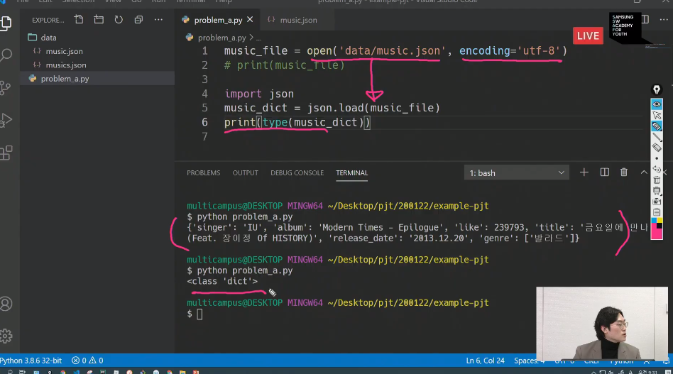
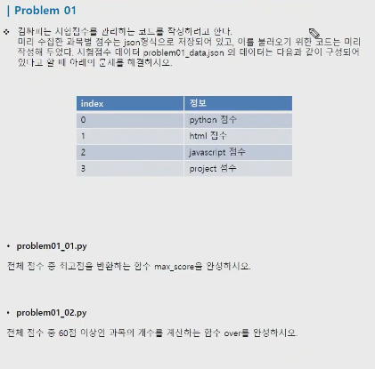
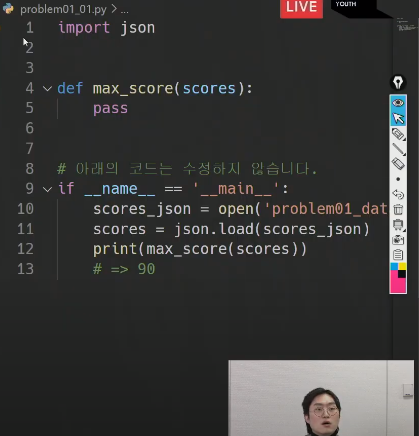
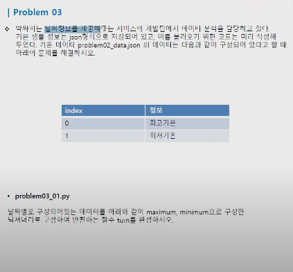
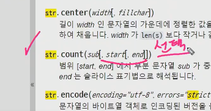
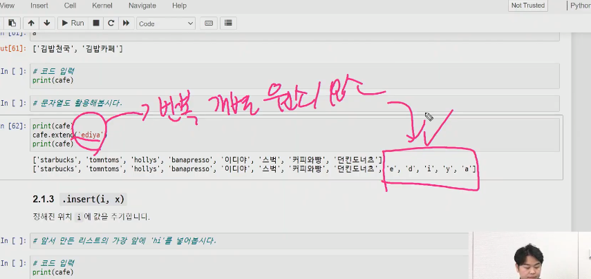
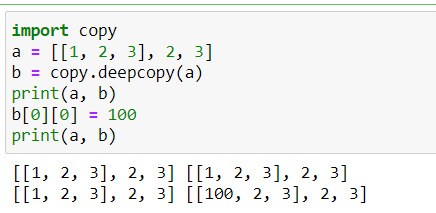
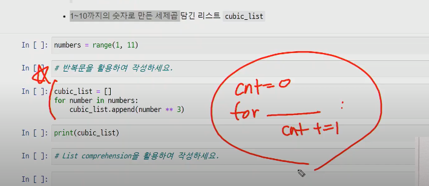
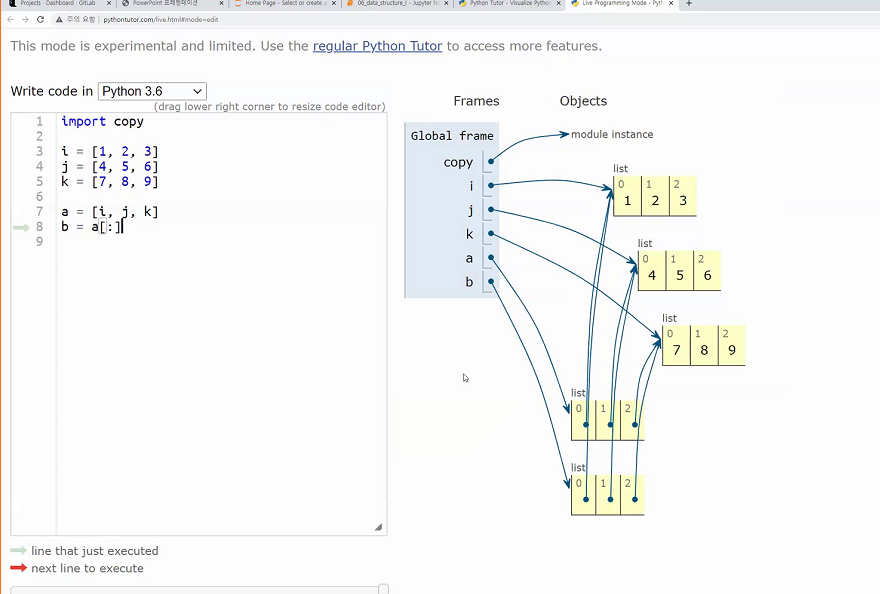

# new_note

## 210120 Wed

- 입력은 모두 string으로 받는다

### 질문

1. 

   ```python
   while input() != '안녕':
       print('안녕할때까지 인사할게요')
   # 안녕이라고 치기전까지 print문구가 계속나오게 하려면..?
   ```

2. 

   ```python
   num = input()
   x = len(num)
   while x > 0:
       print(num[x-1])
       x -= 1
   # 다른 방법도 궁금합니다..!
   ```

## 210121 Thrs

- ```python
  '185'[-1] == 5
  '185'[-2] == 8
  ```

- workshop 1

  ```python
  # 상수는 대문자로 써보자!
  N = 10
  for i in range(1, N+1):
      if N % i == 0:  # 괄호 밖에서는 연산자끼리 띄운다.
          print(i, end = '')  # 괄호 안에서 연산자끼리 붙인다.
  ```

- whorkshop 2

  ```python
  # sort()는 함수 => 리턴이 있다.
  # sorted()는 메서드
  sorted((2, 1, 3))
  # [3, 2, 1].sort()는 가능 하지만 return되질 않는다. 3,2,1이 1,2,3으로만 바뀌기만 한 것. 
  # 따라서 x = [3, 2, 1].sort()
  # x.sort() 이 경우엔 이런식으로 풀어야됨
  
  # (1, 3, 2).sort()는 불가능
  ```

- homework 홀수만 담기

  ```python
  range()
  ```

- for문으로 1~5까지의 합

  ```python
  total = 0
  for num in numbers:
      total += num
  print(total)
  ```

- while문으로 1~5까지의 합

  ```python
  total = 0
  idx = 0
  while x < len(numbers) :  # while x <= len(numbers) - 1 대신에 사용 된다!!!!
      total += numbers[idx]
      x += 1
  print(total)
  ```

- `enumerate` 이따보자
  
  - id개념정리필요
- 이제 따로 hw파일 업로드 안해주시니 submission 폴더에서 jupyter notebook하고 본인이 새로 만들어서 정답만 적어 두는것으로 연습하자.
  - ex) python_03_homework.ipynb
  - ex) python_03_workshop.ipynb
- result를 def위에 쓰는 경우
  - local에서 print는 가능하다 == 보는 것은 가능하다
  - 하지만 return(반환, 변형)은 불가능하다. 변경은 불가능 하다.

```python
#평가 예
#정수로 이루어진 리스트 arr의 총합을 반호나하도록 p1을 작성하시오.

def p1(arr):
    return sum(arr)

p1([1, 2, 3]) # 6
p1([1, 2, 3, 4]) # 10
p1([1, 2, 3, 4, 5]) # 15
```

- 리스트/ 딕셔너리 접근 [0], ['key']
- for/while
- 함수 정의(in/out)
- 재귀를 만든다.

- **공지사항**
  - 온라인 학습기간 참여 : 학사사이트 팝업창 통해서 들어와야 합니다.
  - 웹엑스 : 강의 제대로 잘 듣고, 호응
  - 온/오프라인 : 2단계는 온라인유지 1.5단계는 국가 규정에 따라서 정해짐. 최소 2주전에는 공지가 올라갈 것 입니다.
  - 건강설문 : pc방 스탠딩공연장 노래방 주말여행 ... 자제해주세요
  - 월말평가 14~16시(2시간) 공지사항 반드시 확인(부정행위 관련)
    - 월말 3/5 과목 6/10
    - 커트기준 60점 하지만 잘 보셔야 합니다.
    - 파일명 지정. 빈파일 x. 문항 예시 실수로 올리면 안됩니다. 시간 관리
    - 16시 ~ SSAFY 데이 : 기프티콘, 반 응원
    - 캡쳐화면방지 프로그램 반드시 설치하세요
    - 평가 10분전 webex url제공됨
    - 연습지는 검사 받고 사용가능
  - 보충수업 8회 1시간 30분동안 진행됨.
  - 자바 - 원하신다고 갈 순 없습니다. 하지만 시험 잘 보면 가능할수도있음
  - 모바일 응시불가. 되도록이면 크롬에서 설정

## 210122 Fri

### 관통프로젝트(Project)

- 관통 프로젝트(매주 금요일마다, 총 10번의 프로젝트)
- 일정한 목적 달성을 위한 요구사항들을 수행
- 월~목까지 수업했던 내용을 정리하는 것, 복습, 학습을 마무리 하는 시간
- 배울 '**학**' 익힐 '**습**'
- 필수 함수 형성이 목표!

- **시험공부한다 생각하고 하나하나 이해하면서 진행하자**

  - 남의 코드 베끼는 것은 도움이 되지 않는다.
  - 삽집... 메모... 를 하면서 실력이 늘것

- 점심시간 이후에 git lab에 업로드 해주심

- 목표

  - 기본 문법 실습
  - 파일 입출력에 대한 이해
  - 데이터 구조에 대한 분석과 이해
  - 데이터를 가공하고 JSON 형으로 저장

- 영화 데이터를 뽑아서 정렬, 새로 구조

- 오늘은 총 5개의 파일을 수정할 것입니다.

- 프로젝트 명세에서 가장 중요한 것은 '요구사항'

- 딕셔너리 : 자료를 모아놓음, 데이터를 구조화 해놓은 자료구조

  - 결국 dict, josn 의 목적은 key value를 담기위한 목적은 같다.

- 반드시 활용한 데이터 정보 정리 및 저장한 파일ㄹ에 대한 설명과 학습 내용을 README.md에 기록하여 제출

- gitlab에 제출하는 파일/폴더의 구조 : 아래와 같습니다.

  - pjt01/
    - data/
      - README.md
      - problem_a.py
      - problem_b.py
      - problem_c.py
      - problem_d.py
      - problem_e.py

- Git

  - 버전관리(현재 우리가 이런 용도로 이용하고있쥬?), 협업(나중에 곧 활용할겁니다)

- 제출방법

  - `git clone https://lab.ssafy.com/05/a/projects.git`
  - `git init`: 이 파일을 관리 할꺼야. .git이라는 폴더를 생성
  - README.md git ignore.md 2개 파일을 무조건 먼저 생성한할건데
    - `touch .gitignore`: 만들어지면 파일의 왼쪽에 git마크가 만들어져있음 여기에 우리가 원하지 않는 파일을 넣을 수 있다.
      - 사용은 코딩창에 쓰고싶지 않은 파일 예를들어 problem_a.py이렇게 쓰면 ignore된다.
      - *.txt라고 적으면 확장자가 txt인 파일 다 안넣는다 처럼 사용도 가능
      - git.ignore.io 사이트 들어가서 우리가 사용하는 언어,os .. 예를들어 python, vscode, window 검색해서 복사하고 코딩창에 붙여넣기
      - 이렇게 함으로써 add준비가 된것
    - `touch README.md` : '나좀 읽어줘'인데. 설명서로 생각하면됨 우리는 뭘 읽게 해주냐
      - 이 프로젝트 나중에 볼 때 이해할수 있도록
      - 다른사람이 볼때 내가 이 프로젝트를 통해 무엇을 배웠는지 보여주는 용도
        - 예시를 들자면, 일기처럼 의식의 흐름으로 내려가는 방식, 개요(사진사용)/#후기(뭘 배웠는지)#
      - 새로배운점, 어려운점, 스스로의 피드백, 잘한 점, 못한 점
      - 앞으로의 우리들에게 많은 도움을 줄것.(포트폴리오, feedback)
      - 깔끔하게 정리한 습관을 들이자
  - `git status`: 현재 git의 상태를 알려줍니다.
  - `git add .`: 현자 폴더에 있는 모든 파일, 폴더를 한번에 스테이징
    - working directoty에서 staging area로 add 하게 됨
    - `.`은 뭘 의미하는가.
      - ls명령어에는 data
      - ls -a에는 . .. .git 이런것들이 나오는데 이런것들은 숨김 파일, 폴더라는 것
      - 결국 `.`은 현재 내폴더 그리고 그 하위 폴더까지 `..`은 상위 폴더
    - Warning: LF 뭐시기가 나오는데 warning은 ''주의'' LF(Line Feed)가 CRLF(Carriage Return Line Feed)로 replace 되는것
      - LF : 한번 내리는것(내려쓰기)
      - CRLF : 오른쪽으로 가고 한번 내리는 것(내려쓰기)
      - warning을 굳이 해결하고자하면 #window git CRLF를 검색하면 `git config --global core.autocrlf true`를 입력
  - `git status`: 현재 git의 상태를 알려줍니다.
  - `git commit -m '메시지를 입력'`
    - staging area에서 .git에 저장
  - git lab 사이트에 들어가서 새프로젝트를 만듭니다. 이름은 `pjt01` 으로 생성 후 create project
  - `git remote add origin '사이트 주소'`: git올려야 하는 주소좀 알려줘
  - `git push origin master`: origin에 master를 올릴게
  - 권한설정
    - 설정 -> 회원 -> select members to invite쪽에 교수님 추가 -> choose a role은 maintainer -> add ro project

#### pjt01 실습예시

- music.json을 활용(파일을 불러와라! # python file io(입출력0)검색 -> 공식문서 docs.python.org에서 확인)

  ```python
  # 파일을 읽고 쓰기 (docs 7.2.)
  # open()이라는 함수를 사용. 두 개의 인자를 주는 방식
  # open()은 내장 함수
  # 위치가 우선순위인 인자 위치인자(기본값을 우리가 직접 정해줘야함)
  # mode = 'r' 처럼 기본값이 정해저 있는 것은 기본값 인자(필수는 아니지만 우리가 안넣으면 정해진 기본값이 나오는 인자)
  기본적으로 open(file)을 하게되면 파일이 열린다!
  open('music.json')  # 현재 music.json은 내가 불러오려는 위치와 같은 장소에 없다.
  open('data/music.json')  # data라는 폴더안의 musiic.json파일을 가져온다.
  
  music_file = open('data/music.json')
  print(music_file) #=> <_ioTExt.. name = 'data' mode = 'r'> 이는 단순히 파일을 연 것
  # 파이썬 내부에서 사용할 수 있는 dict변환으로 시켜줘야함(# python json to dict검색 -> basic Usage -> json.load)
  # json.dump는 dict -> json
  # json.load는 json -> dict(json을 파이썬 객체로 바꿔준다.)
  import json
  json.load(music_file)
  music_dict = json.load(music_file)
  print(music_dict) #=> error cp949 발생->검색해보니? with open('m.json, encoding='utf-8')
  # 파이썬 내부 확장자 형태로 바꿔줘야한다.
  music_file = open('data/music.json, encoidng='utf-8) 로 수정
  # 다시 실행해보면 실행 됨(dict구조로 파일이 출력 된다.)
  # 진짜 dict인지 type()을 통해서 확인을 해봐야한다.
  ```

  

- 제공되어있는 데이터에서 singer, title 정보를 가져온다. 정보를 dict를 반환하는 함수를 작성한다.

  ```python
  # 참고
  import pprint  # pretty print 예쁘게 출력해줄게
  pprint.pprint(music_dict)  # 결과를 예쁘게 출력해주는 기능
  # 이제 정보를 가져와보자
  # value에 접근하기 위해서는 키로 접근한다!
  # 방법1 : []
  singer = music_dict['singer']
  title = music_dict['title']
  print(singer, title)
  # 방법2 : 안에있는 도구를 활용(메서드)
  album = music_dict.get['album']
  # 차이는 []로 접근했을때 안에 자료가 없으면 error
  # get은 자료가 없을때 return을 해준다. none을 return해준다. none은 true false활용가능
  
  # 이제 가져온 정보를 새로운 dict로 반환하는 함수 music_info를 완성합니다.
  # 제공된 데이터를 함수에 넣어서 반환해야한다.
  def music_info(music_dict):  # 일반적으로 보낼것과 받을것 이름은 동일한 것이 좋다.
      singer = music_dict['singer']
  	title = music_dict['title']
  	music_info(music_dict)
  # 새로운 dict에 넣어야 한다.
  # result라는 변수를 만들어서 그 안에 새로운 결과를 넣어준다. #
  def music_info(music_dict):
      
      result = {}
      singer = music_dict['singer']
  	title = music_dict['title']
      
      result['singer'] = singer # singer라는 키의 value값에 singer변수를 집어 넣겠다는 의미
      result['title'] = title
      
      return result
  
  pritn(music_info(music_dict))
  ```

- 초반 정리 :파일을 불러와서 번역하고 그 파일을 변형시킴

  

  - import는 위로 올린다!

  - 작성된 코드에는 주석을 달면서 복기하자

  - ```python
    #스텝을 정리해보면
    # data폴더 안에 들
    ```

  - 월말평가에서도 코드에 상세하게 주석을 남겨놓자

- 이번에는 여러개의 자료가 들어가 있는 musics.json을 가져와보자

  ```python
  # list상태의 자료를 가져와보자.
  import json
  # data폴더의 musics.json파일을 가져오자. 인코딩도하자
  musics_file = open('data/musics.json', encoding='utf-8')
  # json을 변환!
  musics_dict = json.load(musics_file)
  # 추출로 잘 왔나 확인
  # print(musics_dict)
  # print(type(musics_dict) # 타입도 확인해본다 => list
  
  def music_info(musics_list):  #musics_list인자를 받음
      result = []
      for music in musics_list:
          info = {}
      	singer = music.get('singer')
          title = music.get('title')
  		info['singer'] = singer
          info['title'] = title
          
          # result.append(info)
          result += [info]  # dict형태의 info를 []로 감싸서 더해준다
          				  # 하나의 딕셔너리를 리스트의 요소로 넣어서 각 리스트들을 다 더한것
              			  # info가 합해진다기보다 둘이 연결된다고 이해하면 좋을 듯
      return result
  music_info(musics_list)  #musics_list를 호출
  
  ```

  

### 시험공지, 예제풀이(월말평가)






- 오늘 pjt한 형태로 나올 것

- pdf py파일이 제공됨 문제에서 요구하는 파일을 수정하면 됨

- error exception파트는 제외

- 내장함수는 웬만하면 사용하지 않고 코딩한다고 생각하면 됨

- practice, homework, workshop 문제들을 되짚어 보는게 좋습니다.

  - 함수 선언, 호출
  - 선언하는 부분에 대한 구조, 로직

- edussafy들어가서 파일을 다운로드받습니다. 

  - 압축파일, 명세파일

- 제출방법

  - 월말평가라는 폴더를 `압축`해서 보내야한다.
  - 우클릭 후 보내기 -> 압축폴더 -> 이름은 `서울_2반_김명준`이렇게 압축한다.
  - 업로드는 깃으로 하는 것은 아니고 ssafy 사이트에 제출

- ```python
  # return이 있어야 반환을 합니다.
  # 최고점 예시 풀어보면
  def max_score(scores):
  #풀이 1 : max함수
  	return max(scores)
  #풀이 2 : 하나하나 돌면서 비교
  	result = 0
  	for score in scores:
          if score > result:
              result = score
      return result  # 아니면 result를 리턴
  ```

- ```python
  # 전체 점수 중 60점 이상인 과목의 개수
  def over(scores):
      # print(scores)로 어떤 scores가 오는지 확인
      count = 0
      for score in scores:
          if score > 60:
              count += 1
      return count
  ```

- 

- ```python
  # 음식점에서 판매하는 메뉴의 개수를 반환하는 함수를 완성
  # menus key의 value값이 필요하다
  # 방법 1
  def menu_count(restorant):
      menus = restorant.get('menus')
      count = 0
      for menu in menus:
          count += 1
      return count
  # 방법 2
  def menu_count(restorant):
      return len(resorant.get('menus'))
  ```

- 

- ```python
  #list 안에 list요소들이 들어 있는 경우(2차원 배열)
  # [[9, 3], [9, 0]]
  # 여기서 최고는 최고끼리 최소는 최소끼리 모으는 방법
  def turn(temperatures):
      # print(temperatuers)를 해서 내부에 뭐가 들어있는지 확인해보고 시작하자
      # []요소들로 이루어진 []
      for temperature in temperatures:
          print('최고기온', temerature[0])
          print('최저기온', temperature[1])
          # 추가적인 리스트를 생각해보자
  ```

- ```python
  def turn(temperatures):
      maximum_temp = []
      minimum_temp = []
      for temperature in temperatures:
          # print('최고기온', temerature[0])
          # print('최저기온', temperature[1])
          # 추가적인 리스트를 생각해보자
          maximum_temp += [temperature[0]]
          minimum_temp.append(temperature[1])
      result = {}
      result['maximum'] = maximum_temp
      result['minumum'] = minimum_temp
      return result
  ```

- 정리 

  - PJT01 -> git /월말평가 -> edu ssafy

### 관통프로젝트(실습)

#### 1. git절차

- git init

- touch .gitignore

- touch README.md

- git add .
- git commit -m 'fdsa'

- git remote add originhttps://lab.ssafy.com/aud1132/pjt01.git

- push

## 200123 Sat

### 함수

#### 개념

- 함수는 일을 하는 방법을 정리한 값

- 기본 형식

  ```python
  def func(n):  # func라는함수에서 변수n을 다룬다. n은 인자를 받을 준비
  vvvvreturn n + 2 # 변수를 다루고 나서 n + 2값을 반환한다.
  func(2)  # func함수를 호출하고 n이라는 인자에 2를 전달한다.
  ```

- `print` vs `return`

  ```python
  def func(a):
      b = a + 2
      print(b)
  func(2)  #=> 4가 출력된다.
  print(func(2))  #=> None을 반환받았기 때문에 None이 출력된다.
  
  def func(a):
      b = a + 2
      return b
  func(2)  #=> 아무것도 출력되지는 않지만 b를 반환받은 상태
  print(func(2))  #=> b를 반환받았기 때문에 b값이 4가 출력된다.
  ```

- return은 오직 한개의 개체만 가능하다.

  ```python
  return a, b ##=> 이경우는 (a, b)로 tuple한 쌍을 반환한 것.
  ```

- 아무것도 return하지 않으면 None이 반환된다.

- 정렬함수

  ```python
  a = [5, 6, 4, 2, 1, 3]
  a.sort()  # a원본을 변환
  print(a)  #=> [1, 2, 3, 4, 5, 6]
  
  sorted(a)  # a파일을 정렬해서 그것을 새로운 list에 담음
  print(a)  #=> [5, 6, 4, 2, 1, 3]
  print(sorted(a))  #=> [1, 2, 3, 4, 5, 6] 
  ```

- 인자

  - 위치인자 : 인자값을 받아서 사용되는 인자

  - 기본값인자 : 기본적으로 인자값이 정해져있는 인자

    - 기본값인자 뒤에 위치인자가 올 수 없다.

  - 키워드인자 : 직접 변수의 이름으로 특정인자를 전달

    ```python
    def func(name, age):
        return pass
    func(age=15, name='명준')
    ```

  - 가변인자 : 여러개의 인자처리, 매개변수 부분에 *표시

    ```python
    def func(*args):
        return args
    b = func('명준', '남호', '익주')
    print(b)  #=> ('명준', '남호', '익주')
    
    def func(*args, prof):
        print(f'교수님{prof}, args)
    func('유태영', '명준', '남호')  #=> 오류발생. 어디까지가 *args인지 알 수가 없다.
    # 이 경우는
    def func(*args, prof):
        print(f'교수님{prof}, args)
    func('유태영', '명준', prof='남호')  # 이런식으로 명명해줘야한다.
    ```

- ```python
  def get_secret_word(numbers):
      result = ''
      for number in numbers:
          result += chr(number)  # result에 number를chr로 변환한 것을 하나씩 추가
      return result  # result값을 반환
  
  get_secret_word([83, 115, 65, 102, 89])  #=> str형식의 'SsAfY'가 저장되어있음
  print(get_secret_word([83, 115, 65, 102, 89]))  #=> 실행시 SsAfY가 출력
  # 하지만 이것은 None이다. 출력하는 기능만 갖고있고, return받은 값은 없기때문
  ```


## 200125 Mon


- break. continue. else
- 함수
  - 기본적으로는 위치인자를 갖는다.
  - 순서를 바꿔서 호출하는 것도 가능
    - 처음에 호출을 바꿔하면 그 이후에는 모두 이름을 붙여서 호출한다


- Local > Enclosed > Global > Built-in scope

### 데이터 구조 및 활용

#### Today?

- 데이터형식.행동()
  - 'Hi'.lower()은 뭐가 될지?
  - [1,2,3].remove(1)은 뭐가될지?
  - [1,2,3].count(1)은 무엇인가요?
  - {'바나나'}.add('수박')
  - {'b':'banana'}.get('b')
- 데이터 형식에 맞춘 행동을 볼 것입니다.

#### 노트

- Python은 진입장벽이 낮다

  ```python
  # [1,2,3] 리스트에서 1을찾는다면
  cnt = 0
  for n in numbers:
      if n == 1:
          cnt += 1
  # 이것을 단순히
  [1,2,3].coount(1)로 쓸 수 있다.
  ```

- 오늘은 내장되어있는 메서드들을 읽어본다.
- 영어 원문으로 읽어보는 것을 사실 추천합니다.
  
  - 메서드 등 자료들을 찾아볼때
- 
  
  - []로 표시되어있는것은 선택적으로 사용가능
- 
  - print('1', '2', '3')이런식으로 넘겨줄수 있는것
  - dict(a = 'apple')이런식으로 넘겨주는 것

- 
  
  - isnumeric과 isdigit과의 차이
- 

- 
  - list는 같은 객체를 가리키기 때문에 하나의 요소를 변경하면 a, b 둘다 결과가 같다.
  - 신기한 스쿨버스 생각으로 따라와라
- 
  - 중요한 내용
  - 
  - 
  - 이경우엔 deepcopy를 사용한다.
  - 

- 
  - 좌측은 리스트에 원소를 하나식 추가
  - 우측은 cnt를 1씩 올리기

- 

- 

- 

- 

- 리스트의 요소의 형식을 변경해주는 세가지 방법

  

  ​	

- 
  
  - zip은 저렇게 하나씩 묶어준다.
- 
  
  - list 와 set의 차이
- 

- 정리
  - 'Hi'.lower()은 뭐가 될지?
  - [1,2,3].remove(1)은 뭐가될지?
  - [1,2,3].count(1)은 무엇인가요?
  - {'바나나'}.add('수박')
  - {'b':'banana'}.get('b')

- 결국에는..

  ```python
  [1,2,3].count(1)  #이처럼 함수를 호출하는것
  데이터형식.행동()   # 이것을 '메서드'라고 한다.
  ```

- .pop() 제거하기 함수
  - list **(순서있음)**
    - pop()맨뒤
    - pop(idx)특정 index
  - set **(순서가없음)**
    - .pop() 랜덤
  - dict **(순서는 없는데 key, value쌍임)**
    - .pop(key)
    - key로 접근해서 pop하는 것
  - 각각이 자료형에 따라서 이해해보자.

#### 교수님시간

- list comprehension은 알고리즘에서 자주 사용하게 될거임.

- md(markdown), html wishwig하지 않다. 내가 치는 것이 그대로 보이지 않는다.

  - 노트북 파일조차도 사실은 딕셔너리

- return 없이 주어를 바꾸는 method

  - list와 같은 것

- **string은 주어가 바뀌지 않는 method => imutable**

  - .strip() .split() ... 이런 것들은 **새로 만들어서 바꾸는 것**
  - 원본은 남아있는다.

- .split()

## 200126 Tue

### 오전

- string은 고치는 것이 불가능하다. 

- 뭐가 다르게 쓰이는지 봅시다. 활용해봅시다 => 시험가능성

- copy deepcopy 시험내기 좋습니다.

  

- workshop 3번이 어렵

### 오후

- 모듈은 파일(또는 스크립트)이다.
  - 무슨파일이냐? 코드를 담고 있는 파일이다.
- 단어Convention
  - True, False 를 return하는 함수의 접두사 **'is'**


- 남이 짜놓은 코드들은 '라이브러리'

- 그 라이브러리들중에서 인증된 것을 설치하도록 도와주는 패키지 관리자(pip)

- 콘다는 뭔가요?

  - 스타크래프트 깔려서 온 컴퓨터

- 패키지는 파일들의 집합

- from, import 공부하는데 생기는 _ _pycache_ _라는 폴더..?

  - **package 폴더 안에 생긴다.**
  - 컴파일, 인터프리터 언어의 차이
    - 중간과정없이 실행이 가능하면 인터프리터다. 라고 생각하자 지금은
  - C는C파일을 실행할 수가 없다. 하지만 파이썬은 가능하다.
  - C는 컴파일이라는 작업이 필요하다.
    - gcc라는 컴파일에게 test.c라는걸 넘기면 사람이 읽을 수 없는 파일을 넘겨주고 test.program을 실행하게된다.
  - 파이썬은 인터프리터
    - 다른 파일을 빠르게 실행을 해주기 위해서 필요한 파일
  - 아니 그럼 이런거는 내가 원하지도 않았는데 생겨나면 git이 관리할때는 어떻하냐
    - **gitignore.io에서 python부분에 반드시 들어가게 되면서 git에서 관리를 할때 무시를 하게된다.**

- ```python
  if '__name__' = '__main__'에 대해서 알아보자.
  
  # my_package/neo/tools.py 경로인 상태에서
  # '남'/'나' 항상 실행
  def my_func():
      return 'Hello'
  
  # 나를 실행하면 실행되는 부분
  print('hi')
  
  
  ```

  - ```python
    from my_package import intro
    
    # hi가 출력
    # import만으로 한 번 실행된다는 것을 의미한다.
    ```

  - ```python
    from my_package.neo import intro
    my_func()
    # import하는 시점에 hi가 출력되고
    # error => func()안에 변수가 지정되지 않았음
    # 실행되는 과정을 알면 ok
    ```

  - ```python
    # 그렇다면 언제는 실행되고 언제는 실행되지 않는지 어떻게 할건가
    bash에서
    python package_practice.py를 실행할때
    이를위해서 만들어진 builtin함수 __name__
    print(__name__) # => __main__
    # 누가 나를 불렀어? 사용자가 불렀어! 라는 의미
    # __main__이 아니면 남이라는 것
    # 따라서
    if __name__ == '__main__':
    # 이 조건을 걸어주면 오로지 내 파일을 실행하고 남의 파일은 가져오긴하나 직접실행했을때 나오는건 나오지 않는다.
    ```

- 