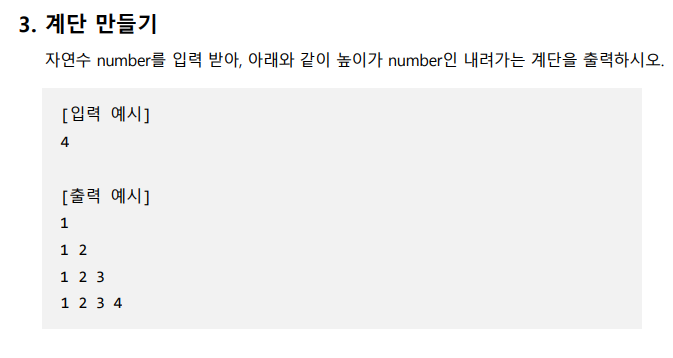

# Practice

1. ### [연습] 함수를 정의하고 값을 반환해봅시다.

   > 리스트 두개를 받아 각각 더한 결과를 비교하여 값이 큰 리스트를 반환하는 함수를 만들어주세요.

   ```python
   my_list_max([10, 3], [5, 9])
   ```

   ---

   ```
   예시 출력)
   [5, 9]
   ```

2. 다음중 오류가 나는 코드는 무엇인가

   ```python
   def func(*args, prof, cnt=5):
       print(prof, args, cnt)
   func('익주', '명준', prof='남호', 7)
   ```

   ```python
   def func(*args, prof, cnt=5):
       print(prof, args, cnt)
   func('익주', '명준', prof='남호')
   ```

   ```python
   def func(*args, prof, cnt=5):
       print(prof, args, cnt)
   func('익주', '명준', prof='남호', cnt=7)
   ```

3. 전체 정수 범위에서 최소값, 최대값 구하기

   ```python
   num_max(-1, -2, -4, 5, 7, 8, 516, 159, -65, -99, -74)
   num_min(-1, -2, -4, 5, 7, 8, 516, 159, -65, -99, -74)
   ```

   ```python
   출력예시
   516
   -99
   ```

4. 

## 00_intro

5. 다음 코드의 출력결과는?

   ```python
   print('hello');print('world');print('let\'s go')
   ```

   ```
   1 v
   hello
   world
   let's go
   2
   hello world let's go
   3
   SyntaxError: invalid syntax
   
   해설:
   기본적으로 파이썬에서는 ;을 작성하지 않는다.
   한 줄로 표기할때는 ;을 작성하여 표기할 수 있다.
   ```

6. 다음 코드중 정상적으로 출력되지 않는 코드는?

   ```python
   # 1
   print('hello\
   world')
   # 2
   print('hello')print('world')
   # 3
   print("""hello
   world""")
   # 4
   print('''hello
   world''')
   ```

   ```
   1
   helloworld
   2 v
   SyntaxError: invalid syntax
   3
   hello
   world
   4
   hello
   world
   ```

7. 식별자를 옳지 않게 작성한 것은?

   ```python
   # 1
   False = 'dsfas'
   # 2
   false = 'dsfas'
   # 3
   Field = 'dsfas'
   # 4
   3fIeid = 'dsfas'
   # 5
   F_e_I_i_d = 'ddsfda'
   ```

   ```
   1 v
   SyntaxError: cannot assign to False
   키워드는 식별자로 사용할 수 없습니다.
   2
   false는 가능
   3
   식별자의 이름은 영문알파벳(대문자와 소문자), 밑줄(_), 숫자로 구성된다.
   4 v
   첫 글자에 숫자가 올 수 없다.
   5
   식별자의 이름은 영문알파벳(대문자와 소문자), 밑줄(_), 숫자로 구성된다.
   ```

8. 다음 코드의 출력결과는?

   ```python
   num_1 = 0o111
   num_2 = 0b111
   num_3 = 0x111
   
   print(num_1)
   print(num_2)
   print(num_3)
   ```

   ```
   73  # 0o는 8진수표현('o'ctal_number)
   7  # 0b는 2진수표현('b'inary_number)
   273  #x는 16진수표현(he'x'adecimal_number)
   ```

9. 다음 코드의 출력결과는?

   ```python
   a = 3.5 - 3.5
   b = 3 - 3
   c = 3 - 3
   
   print(a == b)
   print(type(a) == type(b))
   print(id(a) == id(b))
   print(id(b) == id(c))
   ```

   ```
   True  # a 와 b의 값 자체는 동일함
   False  # type(a)는 float, type(b)는 int
   False  # 서로 다른 변수에 할당되었기에 id가 다름
   True  # int의 경우 -5 ~ 256까지는 같은id로 설정
   ```

   

