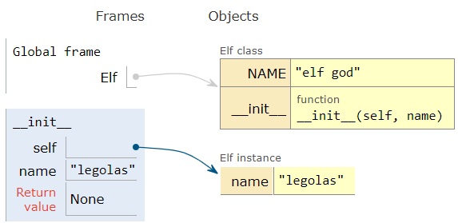
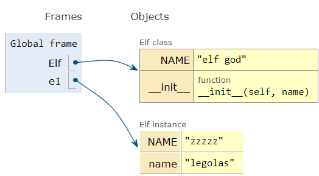

# OOP2

## 1. 인스턴스 & 클래스 변수

### 1.1 인스턴스 변수

- 인스턴스의 속성(attribute)

- 각 인스턴스들의 고유한 변수

- 메서드 정의에서 `self.변수명`로 정의

  ```python
  class Person:
      def __init__(self, name):  # 앞으로 만들 나의 피조물(인스턴스)의 기본 속성을 정의
          self.name = name
          self.ear = 'long'
          self.health = 'good'
  ```

- 인스턴스가 생성된 이후 `인스턴스.변수명`으로 접근 및 할당

### 1.2 클래스 변수

- 클래스의 속성

- 모든 인스턴스가 공유

- 클래스 선언 내부에서 정의

- `클래스.변수명`으로 접근 및 할당

  ```python
  # Elf의 신도 무언가 행동이 필요하다고 생각될때...
  class Elf:
      NAME = 'elf god'
      
      def __init__(self, name):
          self.name = name
  e1 = Elf('legolas')
  print(Elf.NAME) # 신님 이름 여쭤봐도 될까요 ..응답하소서 => elf god
  print(e1.name)  # e1아 너 이름이 뭐니?? => legolas
  print(e1.NAME) # e1아 너 신 이름알아?? 모름 그럼 신님은 아세요? => elf god
  print(e1.NAMEE) # e1아 그럼 너 NAMEE이뭐니? 모름 그럼 신은 아세요? 모름
  				# 'Elf' object has no attribute 'NAMEE'
  e1.NAME = 'zzzzz' # 신님 제가 신님 이름 zzzzz로 바꿀게요?? => 접근은 가능
  				  # 이건 그냥 e1의 개체 속성으로 신이름을 zzzzz로 생각한 것
  print(e1.NAME) #=> zzzzz
  print(Elf.NAME) # 하지만 사실 신이름은 그대로인 것
  ```

## 2. 인스턴스 & 클래스간의 이름공간

### 2.1 이름공간 탐색 순서

- 클래스를 정의하면, 클래스가 생성됨과 동시에 이름 공간(namespace)이 생성된다.

  

- 인스턴스를 만들게 되면, 인스턴스 객체가 생성되고 해당되는 이름 공간이 생성된다.

  

- 인스턴스의 어트리뷰트가 변경되면, 변경된 데이터를 인스턴스 객체 이름 공간에 저장한다.



- 즉, 인스턴스에서 특정한 어트리뷰트에 접근하게 되면 **인스턴스 => 클래스** 순으로 탐색을 한다.
- **class와 instance는 서로 다른 namespace를 가지고 있다.**

## 3. 메서드의 종류

### 3.1 인스턴스 메서드(instance method)

- 인스턴스가 사용할 메서드
- 클래스 내부에 정의되는 메서드의 기본값은 인스턴스 메서드
- **호출시, 첫번째 인자로 인스턴스 자기자신 `self`이 전달됨**

- **활용법**

  ```python
  class MyClass:
      def instance_method(self, arg1, arg2, ...):
          ...
  my_instance = MyClass('self')
  # 인스턴스 생성 후 메서드를 호출하면 자동으로 첫 번째 인자로 인스턴스(my_instance)가 들어갑니다.
  my_instance.instance_method(..., ...)
  ```

	### 3.2 클래스 메서드(class method)

- 클래스가 사용할 메서드

- `@classmethod` 데코레이터를 사용하여 정의

- 호출시, 첫 번째 인자로 클래스 `cls`가 전달됨

- **활용법**

  ```python
  class MyClass:
      @classmethod
      def class_method(cls, arg1, arg2, ...):
          ...  
  # 자동으로 첫 번째 인자로 클래스(MyClass)가 들어간다.
  MyClass.class_method(.., ..)  
  ```

### 3.3 스태틱 메서드(static method)

- 클래스가 사용할 메서드
- `@staticmethod` 데코레이터를 사용하여 정의
- 호출시, 어떠한 인자도 전달되지 않음

- 활용법

  **활용법**

  ```python
  class MyClass:
      @staticmethod
      def static_method(arg1, arg2, ...):
          ...    
  # 아무런 일도 자동으로 일어나지 않는다.
  MyClass.static_method(.., ..)
  ```

### 3.4 비교정리

#### 3.4.1 인스턴스와 메서드

- 인스턴스는 3가지 메서드 모두에 접근할 수 있다.
- 하지만 인스턴스에서 클래스 메서드와 스태틱 메서드는 호출하지 않는다. (가능하다 != 사용한다)
- 인스턴스가 할 행동은 모두 인스턴스 메서드로 한정 지어서 설계한다.

#### 3.4.2 클래스와 메서드

- 클래스 또한 3가지 메서드 모두에 접근할 수 있다.
- 하지만 클래스에서 인스턴스 메서드는 호출하지 않는다. (가능하다 != 사용한다)
- 클래스가 할 행동은 다음 원칙에 따라 설계한다.
  - 클래스 자체(`cls`)와 그 속성에 접근할 필요가 있다면 클래스 메서드로 정의한다.
  - 클래스와 클래스 속성에 접근할 필요가 없다면 정적 메서드로 정의한다.
    - 정적 메서드는 `cls`, `self`와 같이 묵시적인 첫번째 인자를 받지 않기 때문

## 4. 상속

### 4.1 상속(Inheritance)이란?

> 클래스에서 가장 큰 특징은 `상속`이 가능하다는 것이다.
>
> 부모 클래스의 모든 속성이 자식 클래스에게 상속 되므로 코드 재사용성이 높아진다.

- 상속관계가 될 수록 좀 더 적절한 정보를 적재적소에 표현하여 더욱 이해가 좋아짐

- 활용법

  ```python
  class ChildClass(ParentClass):
      <code block>
  ```

#### 4.1.1 타입 검사 방법

- `isinstance(3, int)` : 상속 관계에 있다면 True
- `type(3) is int` : 해당 클래스dls 경우만 True
- `bool.mro()`: 자신의 계보를 따라 올라가는 것.

### 4.2 `super()`

- 자식 클래스에 메서드를 추가로 구현할 수 있다.

- 부모 클래스의 내용을 사용하고자 할 때, `super()`를 사용할 수 있다.

- 활용법

  ```python
  class ChildClass(ParentClass):
      def method(self, arg):
          super().method(arg)
  ```

### 4.3 메서드 오버라이딩

> 메서드 재정의 : 자식 클래스에서 부모 클래스의 메서드를 재정의하는 것

- 상속 받은 메서드를 재정의 할 수도 있다.
- 상속 받은 클래스에서 같은 이름의 메서드로 덮어쓴다.

#### 4.3.1 상속관계에서의 이름공간

- 기존의 `인스턴스 -> 클래스` 순으로 이름 공간을 탐색해나가는 과정에서 상속관계에 있으면 아래와 같이 확장된다.
- `인스턴스 -> 클래스 -> 메타클래스`
- `인스턴스 -> 자식클래스 -> 부모 클래스 -> 메타클래스`

### 4.4 다중 상속

> 두개 이상의 클래스를 상속받는 경우, 다중 상속이 된다.

```python
class Person:
    def __init__(self, name):
        self.name = name      
    def talk(self):
        print(f'사람입니다.')
        
class Mom(Person):
    gene = 'XX'
    
    def swim(self):
        print('첨벙첨벙')
        
class Dad(Person):
    gene = 'XY'
    
    def walk(self):
        print('씩씩하게 걷기')
        
mom = Mom('박엄마')
mom.swim()  #=> 첨벙첨벙
mom.gene  #=> XX

dad = Dad('김아빠')
dad.walk()  #=> 씩씩하게 걷기
dad.gene  #=> XY
dad.talk()  #=> 사람입니다.
dad.swim()  # AttributeError: 'Dad' object has no attribute 'swim'

class FirstChild(Mom, Dad):
    def cry(self):
        print('응애')
    def walk(self):  # Dad walk()의 overriding
        print('뚜벅뚜벅')
        
baby = FirstChild('이아가')
baby.cry()  #=> 응애
baby.swim()  #=> 첨벙첨벙
baby.walk()  #=> 뚜벅뚜벅
baby.gene  #=> XX Mom 클래스 변수를 참조한다.
```

