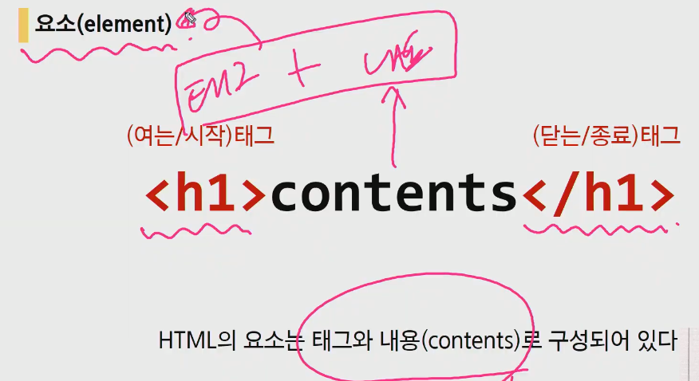
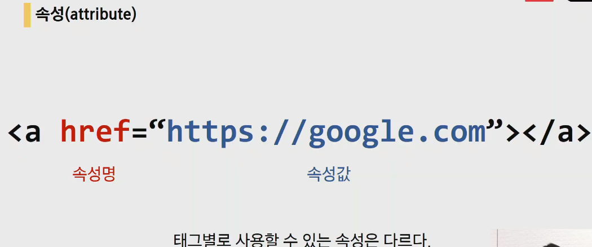

# Web

## 1 개요

### 1.1 개발환경설정

- text editor

- chrome 개발자 도구

  

- 확장프로그램

  

### 1.2 웹? 왜?

- **웹 어플리케이션 개발**을 통해 **SW개발 방법 및 학습** 과정을 익히기 위해서

- 현재 웹 표준

  

  기존에는 W3C에서 승인해줬지만 오늘날의 웹 표준은 WHARWG!


## 2 HTML

> Hyper Text Markup Language

### 2.1 HTML?

- Hyper Text란 기존의 선형적인 텍스트가 아닌 **비 선형적으로 이루어진 텍스트**를 의미하며, 이는 인터넷의 등장과 함께 대두되었다. 기본적으로 Hyper Link를 통해 텍스트를 이동한다.

- 우리가 아는 문서는 하나하나 넘겼어야만 했다. 하지만 Hyper Text는 한 문장에서 다른 문서, 문장으로 자유롭게 드나들 수 있게했습니다. 이 기능 중 중요한 것이 HTML http

  

- 단순 텍스트 구조에 구조와 의미를 더해주는 것이 마크업
  - 태그 등을 이용하여 문서나 데이터의 구조를 명시하는 언어
  - 프로그래밍 언어와는 다르게 단순하게 데이터를 표현하기만 한다.
  - 대표적인 예 : HTML, Markdown
- 웹 페이지를 작성하기 위한(구조를 잡기 위한)언어. 웹 컨텐츠의 의미와 구조를 정의하는데 이때 사용하는 언어가 바로 HTML
- 파일 확장자 명은 `.html`

### 2.2 HTML 기본구조

#### 2.2.1 기본구조


- **html요소** : 열리는 태그와 닫히는 태그로 가장 큰 범주를 형성(최상위 요소, root(근본)라고도 한다.)
- 내부는 **head요소**와, **body요소**로 나뉜다. 

- head요소 : 브라우저에 나타나지 않는다.

  

- body요소 : 브라우저 화면에 나타나는 정보

  

```html
<!DOCTYPE html>  # html이라는 선언
<html lang="en">  # 한국어면 "ko", 웹페이지 읽어주는 기능이 필요(스크린리더가 음성표현에 사용할 언어를 선택하는데 도움을 주는 속성. 아무런 값도 지정하지 않으면 보통 기본적용된 값으로 되긴하나 지정해줍시다!)
    <head>  # head는 브라우저에 나타나지 않는다.
        
    </head>
    
</html>
```


```python
<!DOCTYPE html> # html이라는 선언
<html lang="en"> # 한국어면"ko", 웹페이지 읽어주는 기능이 필요(스크린리더가 음성표현에 사용할 언어를 선택하는데 도움을 주는 속성. 아무런 값도 지정하지않으면 보통 기본적용된 값으로 되긴하나 지정해주자)
    <head>  # head는 눈에 보이는 곳이 아니라고 했습니다.
        <meta charset="UTF-8"> # 어 이건 닫는 태그가 없네? 이런것도 존재합니다.
        					   # 전체문서에 대한 문자 인코딩을 뭐로할래?UTF-8
        <title>Hello, HTML</title> # 웹페이지 들어갔을때 구글, 네이버 보이는 것
    </head>
    <body>
        <p>이것은 본문입니다.</p> # paragraph 본문.
        <h1>나의 첫번째 HTML</h1>
        <a href="https://www.naver.com">네이버로 이동!!</a> # 결국 hyper text를 누가 작성하느냐??? a태그 자체가 링크를 만들어 주는 태그
    </body> 
</html>
```


#### 2.2.2 DOM(Document Object Model) 트리

- 각각의 문서를 객체지향으로 구성을 한다고 생각합시다

- 부모, 자식태그의 연관성이 존재

  

  `<ul>`태그는 `<body>`태그의 자식태그이지만 `<li>`태그의 부모태그이기도 하다!

#### 2.2.3 요소와 속성

- 요소(element) : 태그와 그에 담긴 내용. 단순한 텍스트에 의미를 부여하는 것이 바로 **태그**

  

- 속성(attribute) : key(속성명)과 value(속성값)으로 구성되어있다.

  

  - `href` : hyper text reference

  - 컨벤션

    

    html에서는 컨벤션 지키지않아도 동작은 합니다. 하지만 관습적으로 지키는 약속이 있습니다.(속성사이에서 공백은 없고, 쌍따옴표)

  - global attribute

    