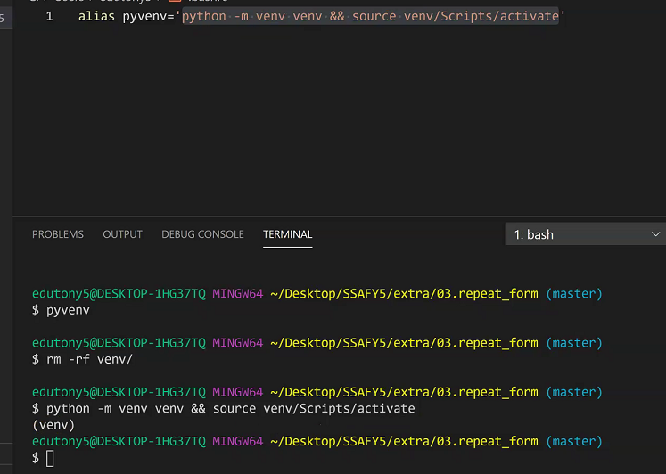
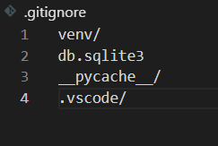
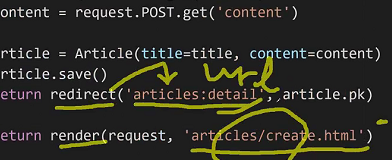

# Django_review

- 번외

윈도우 bash창에서 $ code .bashrc 누르고 시작

bashrc에는 git관련 설정들을 넣어줄수가 있다. 평소에 쓰던 명령어를 단축어로 만들어서 사용을 할 수 있다.

alias pyvenv='python -m venv venv' 하고나서 모두 끄고 다시 code를 열고 터미널에 pyvenv친다면??

venv 형성됨

- 기본세팅

- 앱 -> 모델

  제일처음해야 할거는 모델생성

  

  urlpattern까지만 있으면 makemigrations가 가능해진다.

- .gitignore

  

  /가있으면 일반적으로 디렉토리, 폴더로 명시하고 없다면 일반적으로 파일을 의미

- 

  render에 실제경로작성

  redirect name spacing이용하여 발생시킬 url의 님넥임을 작성

- 

- 

  위 두개의 차이. ModelForm은 Model과 연관이 있고, Form은 모델과 관련이 없다.

  중간에 BaseModel폼이 들어간다 

  

- create.html

  

- views.py
  - created

- 