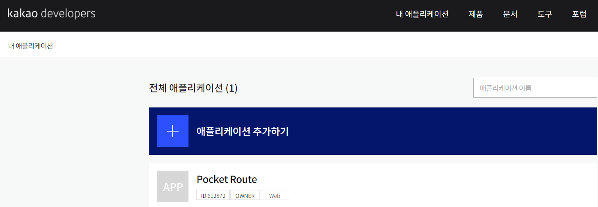
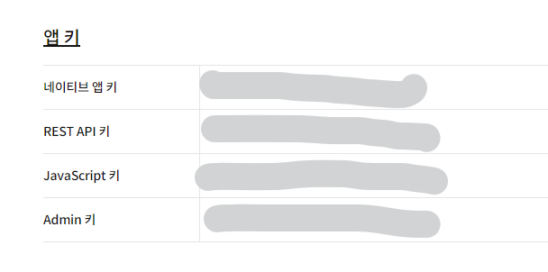

# 소셜로그인

> 카카오, 구글 로그인 구현하기위한 과정을 기록하면서 다른 프로젝트에서도 적용시킬 수 있도록 학습해보자.

## kakao auth

### 이해하기

- kakao API를 이용한 kakao 로그인

- OAuth2.0은 공개 API로 제공되는 표준 인증 방법입니다.
- 로그인이 진행되는 과정
  1. Application -> 인증 코드 요청 -> Kakao Server
  2. Application <- 인증 코드 전달 <- Kakao Server
  3. Application -> 인증 코드로 토큰 요청 -> Kakao Server
  4. Application <- 토큰 전달 <- Kakao Server
  5. Application -> 토큰으로 API 호출 -> Kakao Server
  6. Kakao Serer에서 토큰 유효성 확인
  7. Application <- 응답 전달 <- Kakao Server

### 과정

1.  kakao developers 가입 > 내 애플리케이션으로 이동 > 애플리케이션 추가



2. 해당하는 앱 키를 확인

   JavaScript에서 카카오 로그인을 구현하고자한다면 JS키를 사용하여 로그인을 구현해야함

   

3. JavaScript SDK를 포함시킨다. (Vue의 경우 public  > index.html)

   ```html
   <script src="https://developers.kakao.com/sdk/js/kakao.js"></script>
   ```

1. JS작성

   1. 초기화 함수를 호출 => 성공시 카카오 서버에서 인증코드를 응답

      ```javascript
      window.Kakao.init("JAVASCRIPT_KEY")
      ```

      

   2. 인증코드로 access_token 요청

      ```javascript
      window.Kakao.Auth.login({
          scope: '내가동의한 정보들',
          success: function (authObj) {
              console.log(authObj)
          },
          fail: err => console.error(err)
      })
      ```

      

   3. 토큰으로 원하는 API를 호출(예를들어 간단한 회원정보)

      유효한 토큰을 가지고 있다면(2번단계가 성공했다면) 원하는 정보를 응답으로 받아올 수 있다.

      ```javascript
      window.Kakao.API.request({
          url: '/v2/user/me',
          success: res => {
              console.log(res.kakao_account)
          }
      })
      ```

      

### 전체코드

- index.html

```html

```


